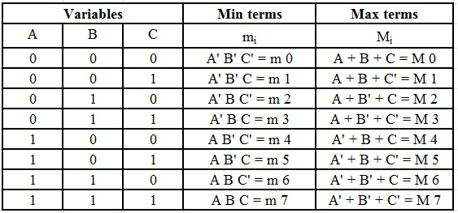

# Sum of Product
Refer the table: 

For SOP, when three terms are multiplied in the table, (later added but not shown in table), the probability of getting 1 is just 1/8.
therefore we want the terms ABC=1, which only happens in one of the 8 cases when all 3 are 1.
(NOTE: total cases are 8, there are 3 bits, each bit can take 2 positions, and we need all 3 bits, so 2*2*2=8)

Now considering a,b,c=1 and their complements as 0,we can form a sequence for all possible combinations, represented by m0,m1...so on.

For POS, we need to do the same for 0, there is only one case where A+b+c=0, where all a,b,c=0, so assume a,b,c=0. 