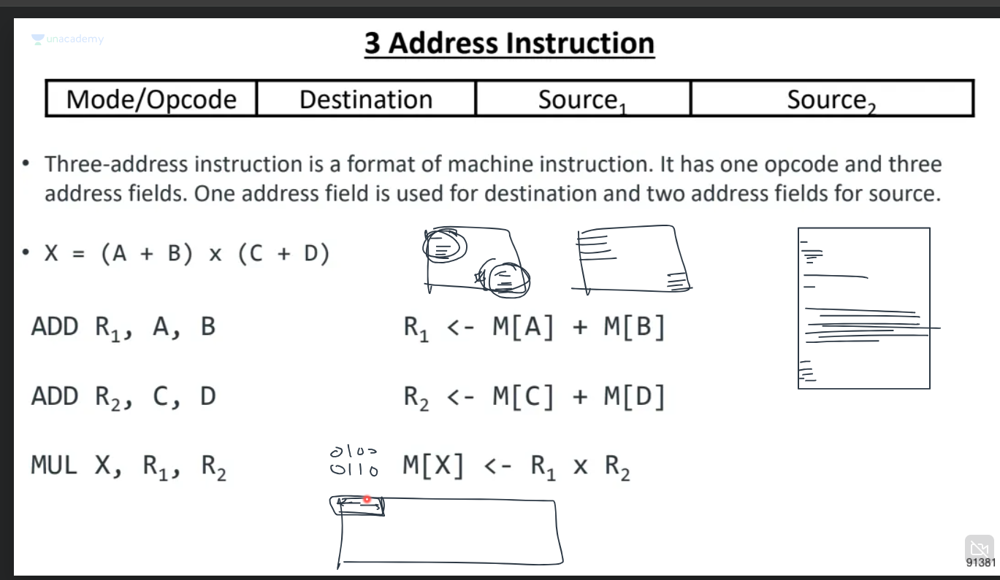
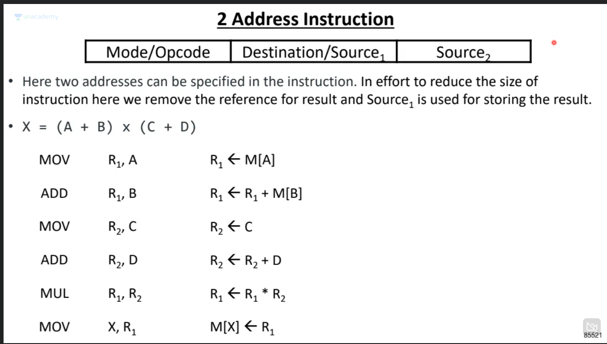
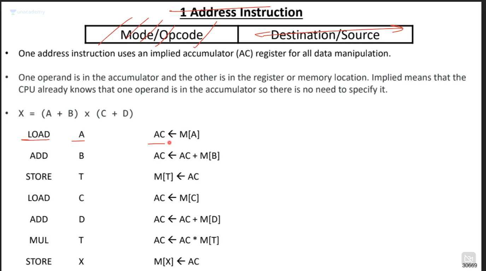
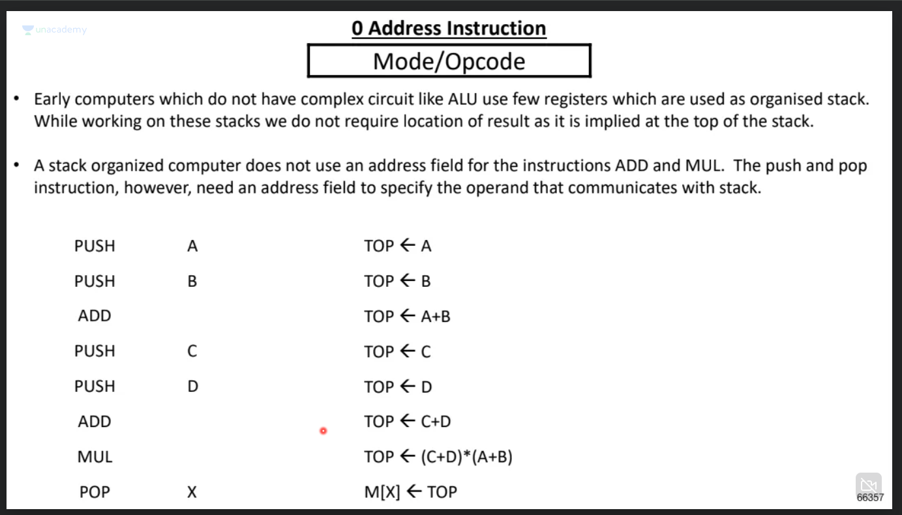
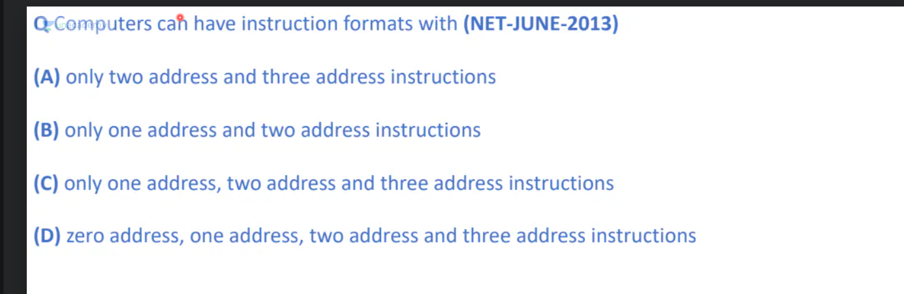
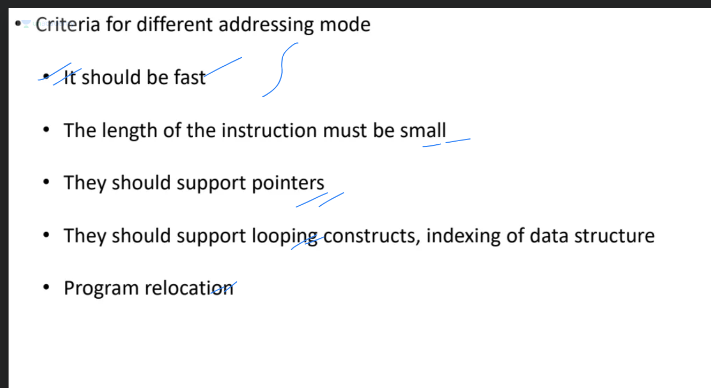
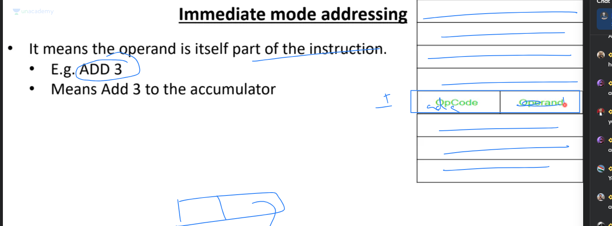
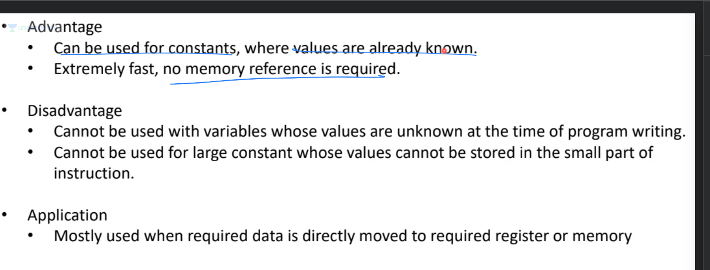
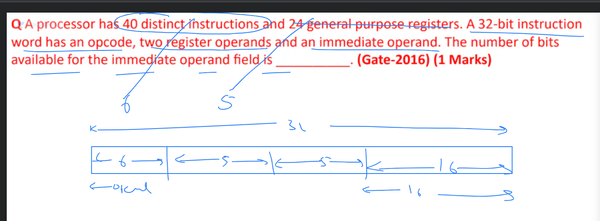
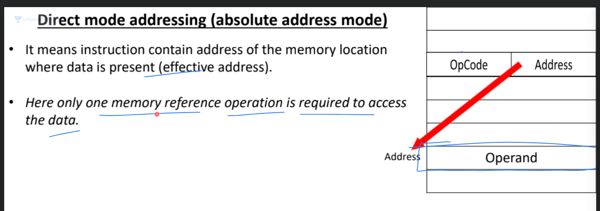

# syntax: grammar of TOC (or a rule)

# semantic: the meaning of a statement

**Note:**In the above image AC represents accumulator

**answer to above:** d

## Instruction set
- represents how many types of instructions can  be run by a machine
- in other words how many different opcodes are there.

# Criteria for addressing modes

# Immediate Mode: Instruction contains operand

## Advantages:

# Direct Mode: Instruction contains address of operand

