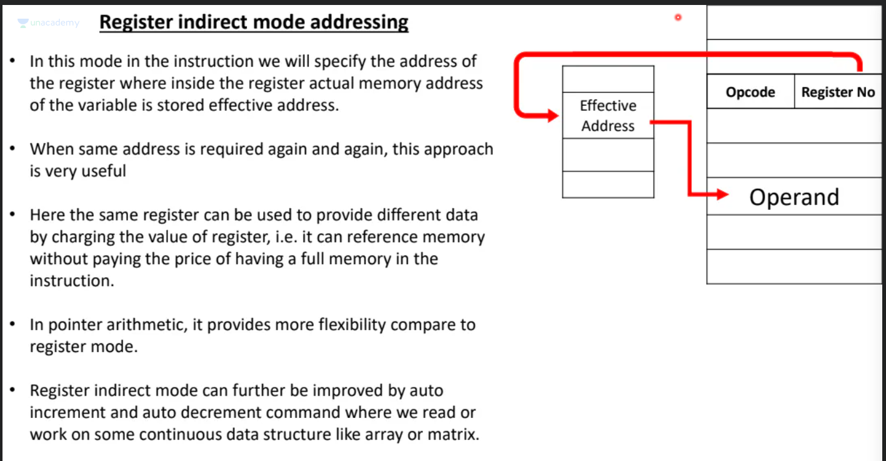

# syntax: grammar of TOC (or a rule)

# semantic: the meaning of a statement

**Note:**In the above image AC represents accumulator

**answer to above:** d

## Instruction set
- represents how many types of instructions can  be run by a machine
- in other words how many different opcodes are there.

# Criteria for addressing modes

# Immediate Mode: Instruction contains operand

## Advantages:

# Direct/Absolute.Effective Mode: Instruction contains address of operand

# Indirect Mode: Instruction contains address of the address that holds the operand

# Implied Mode: If address of operand can be deciphered from instruction definition

# Register Mode addressing

- Registers are expensive and few in a machine
- instruction tells the register number, but because number of registers are less, the bit to specify the register is also less
- because very limited number of registers are less, cannot be used for every instruction

# Register indriect addressing mode / auto increment addressing mode:

 - instruction has the number of register that holds the memory address of the variable

 

 # Base Register

 

 - instruction contains opcode+base register number + offset
 - register tells base address
 - ALU adds offset to base to get operand for current instruction

 