# Interface

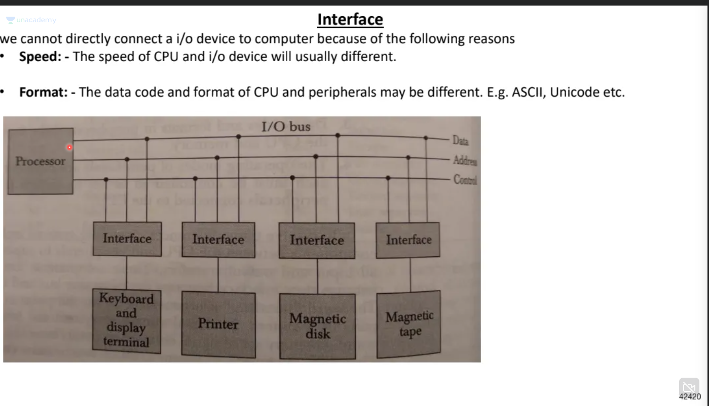

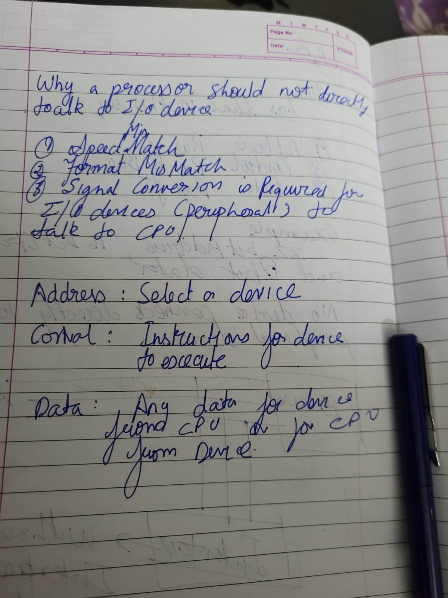

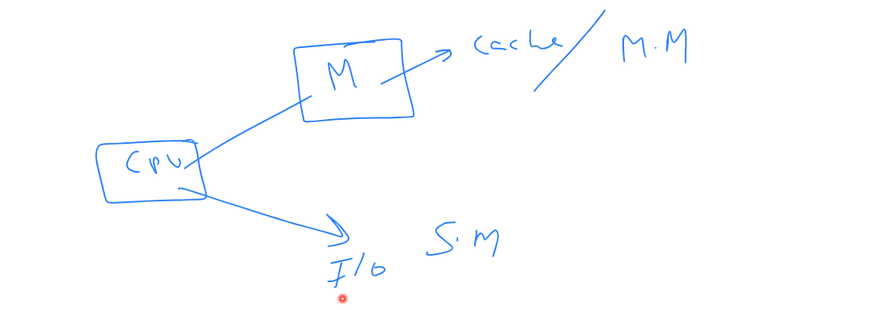

# Memory mapped I/O

Same bus for cpu and I/o devices.

Below image 8085, example of memory mapped I/o:

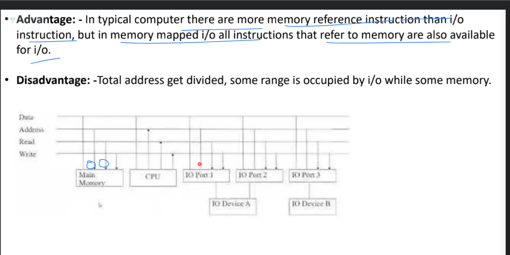

# Isolated/IO  OR I/O processor

A seperate processor for I/O devices, responsibility taken from cPU, example below:

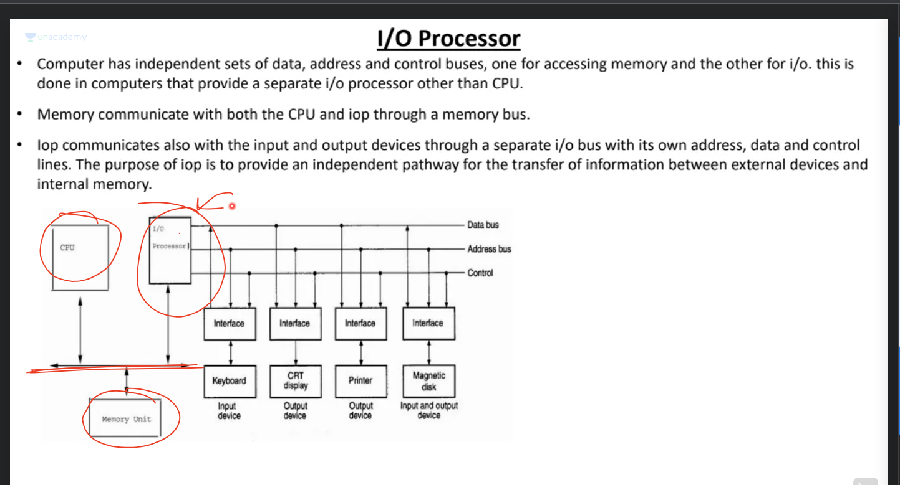

# Data transfer mode:

# Synchronous vs Ascynchronous transfer

- Synchronous transfer data sender and receiver both are on the same clock example Main memory

- Asynchronous transfer data sender and receiver both are on  different clock example I/O devices.

Async: send a strobe to notify data request and ack to acknowledge data recieved, handshake.

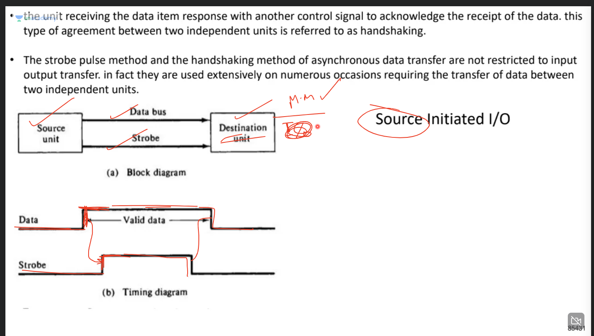

**3 way handshake**

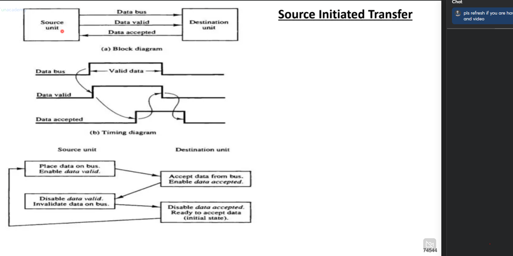

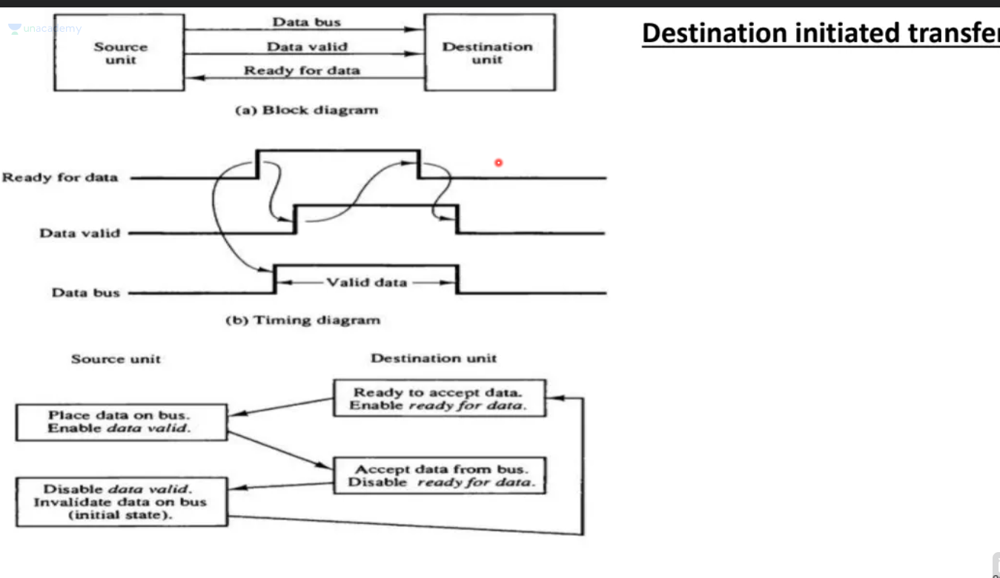

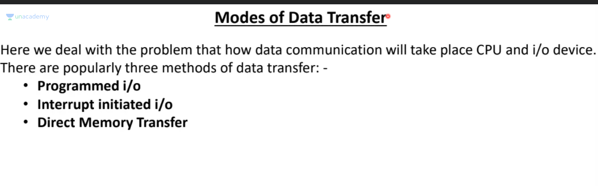

# Programmed input output

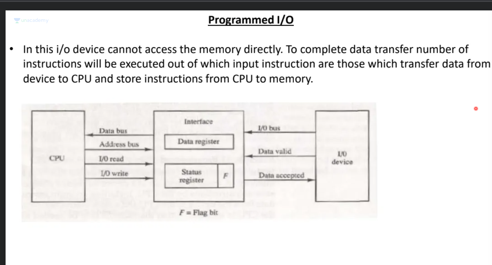

- I/O device puts data valid on the bus
- Interface updates the data in register and puts status flag as true
- CPU reads the status flag, if true pulls data from register
- Once pulled data, notifies interface and it puts status flag as false.

## Problem
**Busy Waiting:** CPU keeps listeningon status flag till its ready, wastes resources (**busy waiting**)

# Interrupt initated I/O

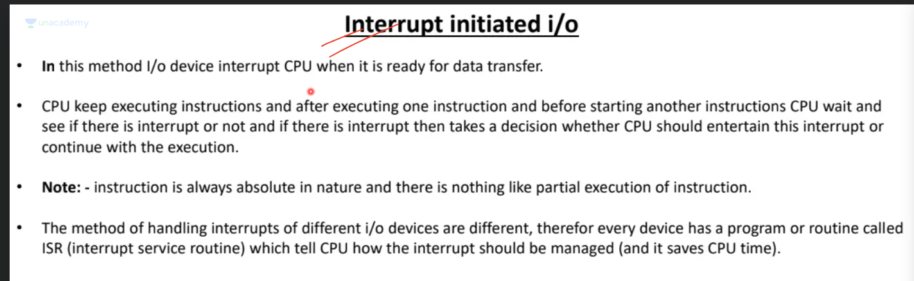

- I/O device sends a request, sent as interrupt
- CPU is executing instructions
- after completing instruction cpu checks interrupt and processes it
- **ISR(Interrupt Service Routine)** a routine/program that tells cpu how to handle the interrupt
- **Two types of interrupt**
- **Vectored** (I/O device tells the address): This address is of ISR
- **Non Vectored** (CPU knows the address, I/O device does not provide this information): CPU already knows ISR

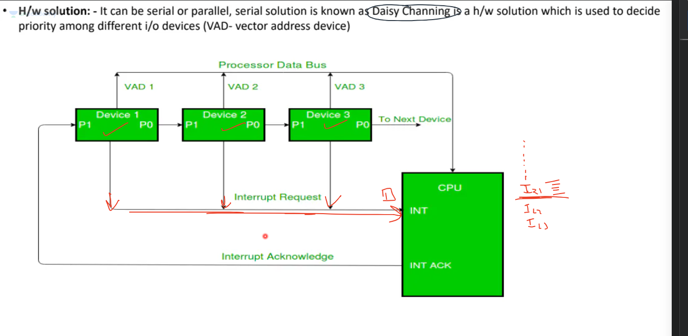

Interrupt based on priority, if 2 or more devices raise interrupt at the same time, then the device with highest priority gets the cpu
usually priority decided by speed of the device.

Devices are arranged in order of priority, when devices want to raise an interrupt, they place 0 in **Interrupt Service Register**
since devices are arranged in order of priority, if any device raises interrupt, no need to check further.

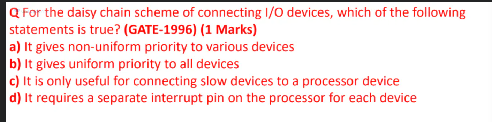

# Direct Memory Access

DMA works on behalf of CPU

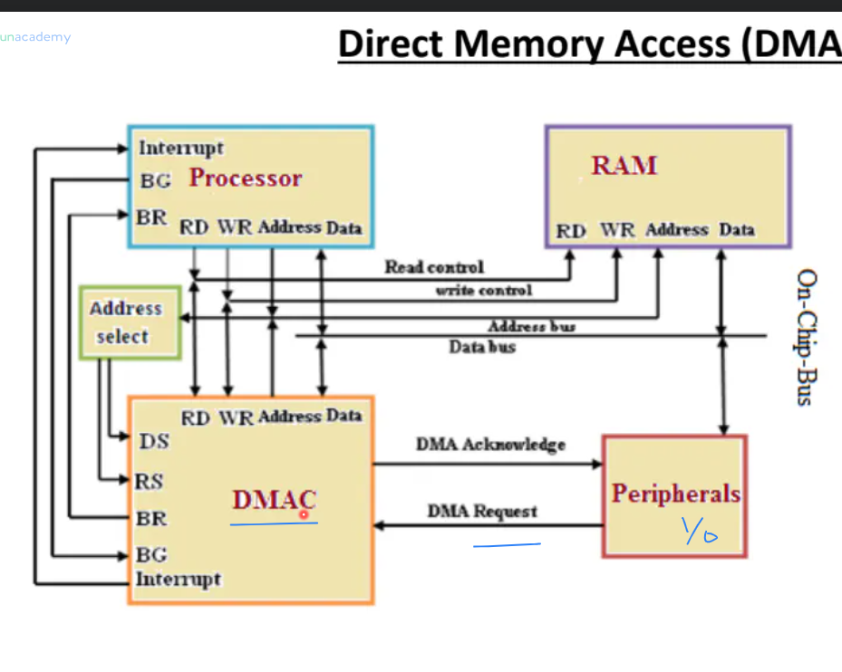

- Device raises interrupt, reaches DMA
- DMA requests bus from CPU
- CPU grants bus
- CPU meanwhile can continue executing the instruction

**Burst Mode:** Processor gives control to DMA, and waits till DMA returns the control.

**Cycle stealing mode** Consistent control not given, Grant Bus to DMA only when not requiring the bus.

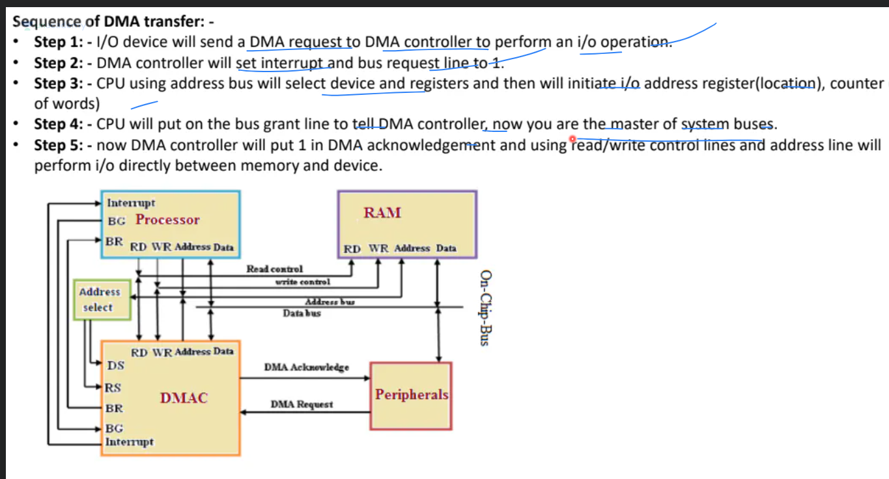

CPU could be doing following in a cpu cycle:
- Instruction Decode
- Intruction Execute
- Instruction Fetch
- Operand Fetch
- Write Back Or Store Result

In **Burst Mode** CPU waits till DMA finishes, in **Cycle Stealing mode** DMA can only have control in Instuction Decode and Instuction Execute phases.

# I/O devices

## Memory Disk

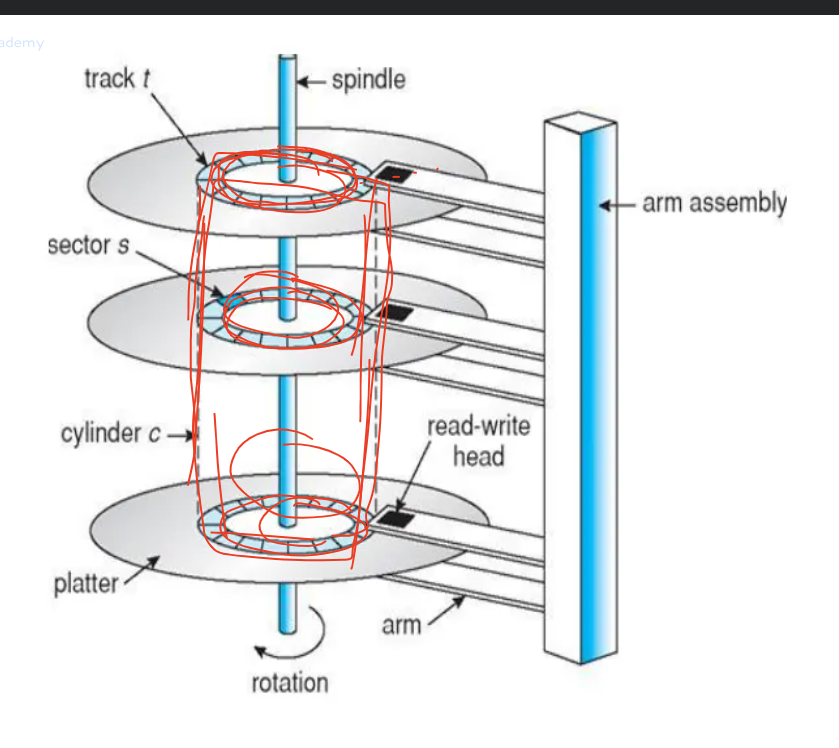

- Data is divided into tracks
- tracks are further divided into sector
- first seek track (seek time), then find sector (rotational latency), then transfer data(transfer time)
- disk rotates in one direction so in worse case might have to wait for the entire disk to rotate
- since in best case we might just arrive at sector, and rotational latency =0, and in worse case we might have o wait for 1 rotational latency then avg rotational latency is taken as **0.5**
- in one rotation read/write header has the ability to read or write 1 track.

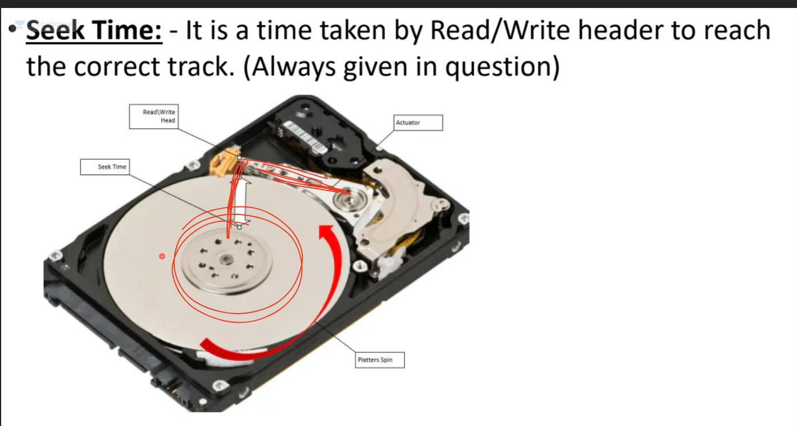

# CPU Frequence and its relation wih cpu cycle

In the context of computer science and digital electronics, "Hz" (Hertz) represents a unit of frequency, which indicates the number of cycles or events occurring per second. In the case of a CPU (Central Processing Unit), it refers to the clock speed, or the rate at which the CPU performs its basic operations, such as fetching, decoding, and executing instructions. Let's break down the relation of these frequencies to a CPU cycle for a gate aspirant:

1 Hz (Hertz): This is the lowest frequency measurement, representing one cycle per second. If we relate this to a CPU, it would mean that the CPU performs one basic operation (e.g., fetching or executing an instruction) per second. In practical terms, this would be extremely slow and unusable for modern computing.

1 kHz (Kilohertz): 1 kHz is equal to 1,000 Hz, or one thousand cycles per second. A CPU with a clock speed of 1 kHz would perform one thousand basic operations per second. Such a CPU would be very slow and is not used in modern computing.

1 MHz (Megahertz): 1 MHz is equal to 1,000,000 Hz, or one million cycles per second. CPUs with clock speeds in the MHz range were common in the early days of computing, for example, in the 1980s and early 1990s. These CPUs could perform one million basic operations per second. They are considered very slow by today's standards.

1 GHz (Gigahertz): 1 GHz is equal to 1,000,000,000 Hz, or one billion cycles per second. This is the range of CPU clock speeds that became prevalent in the late 1990s and early 2000s. CPUs operating at 1 GHz could perform one billion basic operations per second, significantly increasing computing speed and performance.