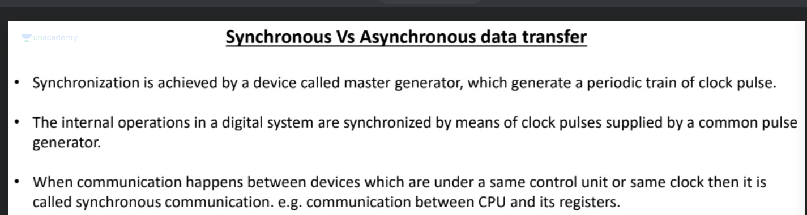

# Interface

# Memory mapped I/O

Same bus for cpu and I/o devices.

Below image 8085, example of memory mapped I/o:

# I/O processor

A seperate processor for I/O devices, responsibility taken from cPU, example below:

# Data transfer mode:

# Synchronous vs Ascynchronous transfer

- Synchronous transfer data sender and receiver both are on the same clock example Main memory

- Asynchronous transfer data sender and receiver both are on  different clock example I/O devices.

Async: send a strobe to notify data request and ack to acknowledge data recieved, handshake.

**3 way handshake**

# Programmed input output

- I/O device puts data valid on the bus
- Interface updates the data in register and puts status flag as true
- CPU reads the status flag, if true pulls data from register
- Once pulled data, notifies interface and it puts status flag as false.

## Problem
**Busy Waiting:** CPU keeps listeningon status flag till its ready, wastes resources (**busy waiting**)

# Interrupt initated I/O

- I/O device sends a request, sent as interrupt
- CPU is executing instructions
- after completing instruction cpu checks interrupt and processes it
- **ISR(Interrupt Service Routine)** a routine/program that tells cpu how to handle the interrupt
- **Two types of interrupt**
- **Vectored** (I/O device tells the address): This address is of ISR
- **Non Vectored** (CPU knows the address, I/O device does not provide this information): CPU already knows ISR

Interrupt based on priority, if 2 or more devices raise interrupt at the same time, then the device with highest priority gets the cpu
usually priority decided by speed of the device.

Devices are arranged in order of priority, when devices want to raise an interrupt, they place 0 in **Interrupt Service Register**
since devices are arranged in order of priority, if any device raises interrupt, no need to check further.

# Direct Memory Access

DMA works on behalf of CPU

- Device raises interrupt, reaches DMA
- DMA requests bus from CPU
- CPU grants bus
- CPU meanwhile can continue executing the instruction

**Burst Mode:** Processor gives control to DMA, and waits till DMA returns the control.

**Cycle stealing mode** Consistent control not given, Grant Bus to DMA only when not requiring the bus.

CPU could be doing following in a cpu cycle:
- Instruction Decode
- Intruction Execute
- Instruction Fetch
- Operand Fetch
- Write Back Or Store Result

In **Burst Mode** CPU waits till DMA finishes, in **Cycle Stealing mode** DMA can only have control in Instuction Decode and Instuction Execute phases.

# I/O devices

## Memory Disk

- Data is divided into tracks
- tracks are further divided into sector
- first seek track (seek time), then find sector (rotational latency), then transfer data(transfer time)

