CPU -> Register -> Cache => MM (Ram, Physical memory) -> SM(Hard disk,Logical memory LM)

Each memory is divided into equal sizes, each division is called:
- page in SM
- block/frame/word in MM
- Cache line sometimes called cache block in cache

Each division size should be same across all types of memory.
Therefore number of divisions is less in MM compared to SM, and less in cache compared to MM.

Usually the size of each block is 1 byte and this is called byte addressable memory.

Table for unit of memory
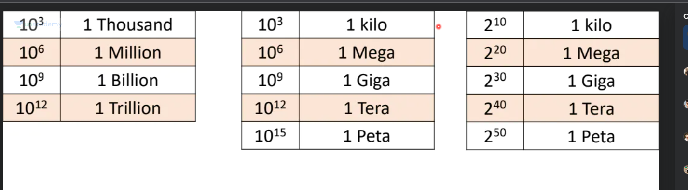

10^3 = 2^10 = kilo
for every 3 power inrease in base 10 or 10 power in base 2
- mega
- giga
- tera
- peta

Size of memory: number of locations(2^size of size of each location) * size of each location(default 1 byte or default assume byte addressible)

# Direct Mapping
Focus on MM and cache.
Divide each block of MM into n words where word is the size of memory location(in byte addressable word size is 1 byte)
Divide each cach line into n words as well
as should be obvious, size of each cache line is size of  each block of MM

since number of cache lines << number of blocks

let size of cache line is n, then take first n blocks and map to each of the n cachelines.
post that, map block number to (block number%n) cache line.

Overall formula also becomes:
CL assigned to block m = (m%n) where n is the number of cache lines

Since each CL holds but one block at a time BUT each block can ever be present in a specific cache line, the obvious CON of this approach is even if a cache line is free, the block will not use it until its mapped to that.

The list of blocks mapped to a CL can be annotated with tags.

Refer the diagrams

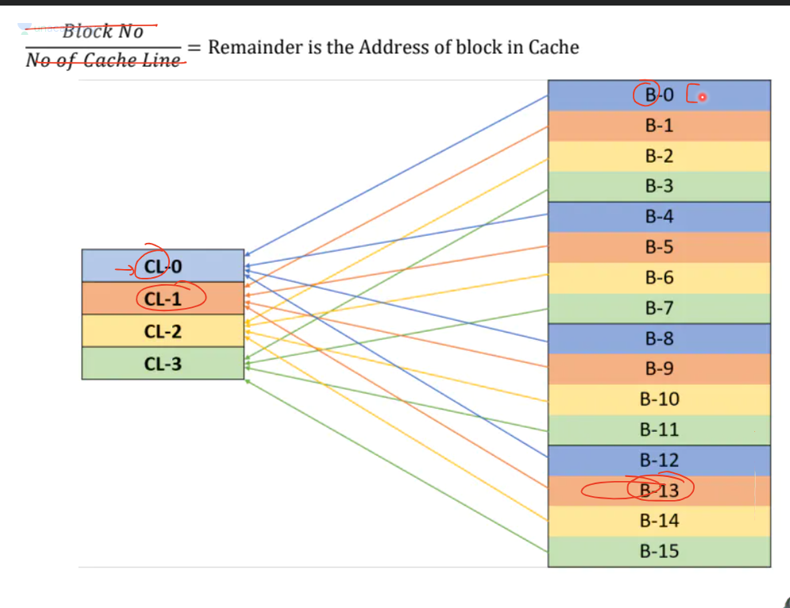
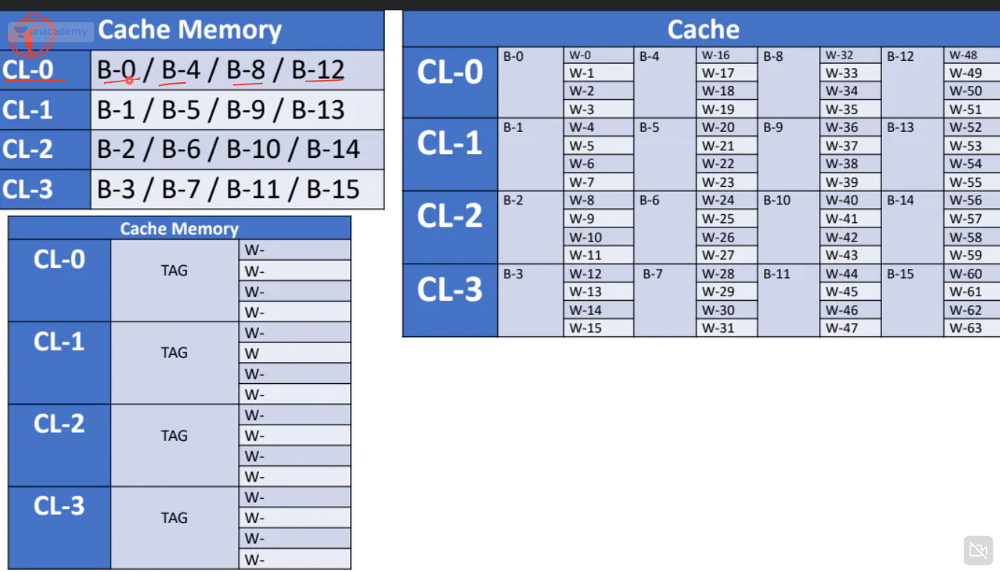

Lets look at division of data in MM in other way

- MM is divided in blocks
- each block is divided into words

Suppose each block has n words and word has m bits
- Take last log base 2(n) of index of word in binary and it tells the block offset
- remaining(n-log base 2(n)) bits tell the position of block in MM

Now suppose in direct mapping each CL has k bits mapped
- the last log base 2(k) of (n-log base 2(n)) tell the CL of the block
- the remaining (n-log base 2(n)) - log base 2(k) tell the tag of the block

Refer the below image:
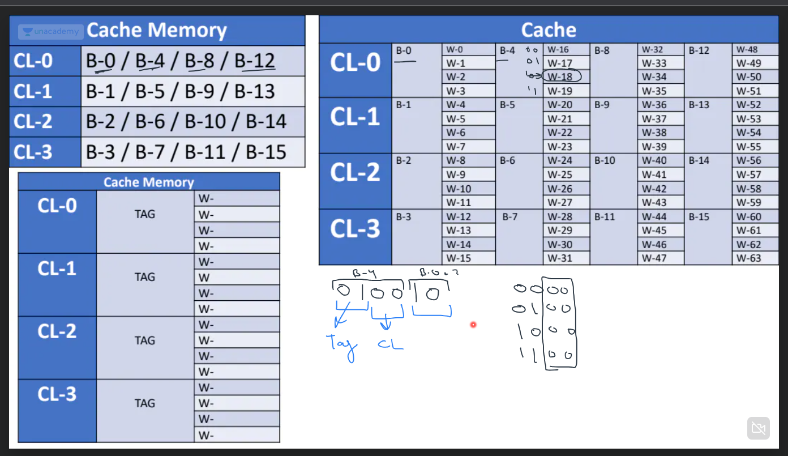

Question:
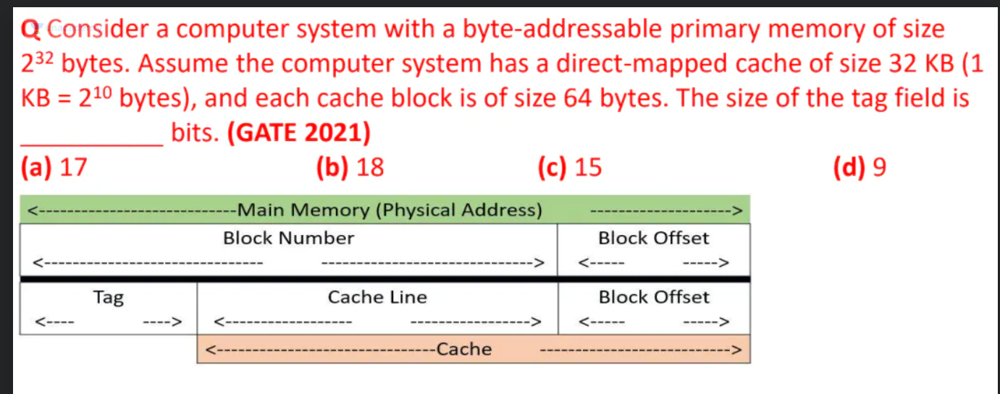

# Remember: 
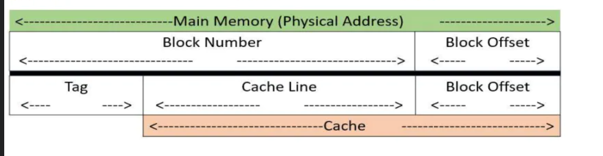

# Explaining the  digital circuit for memory hierarchy
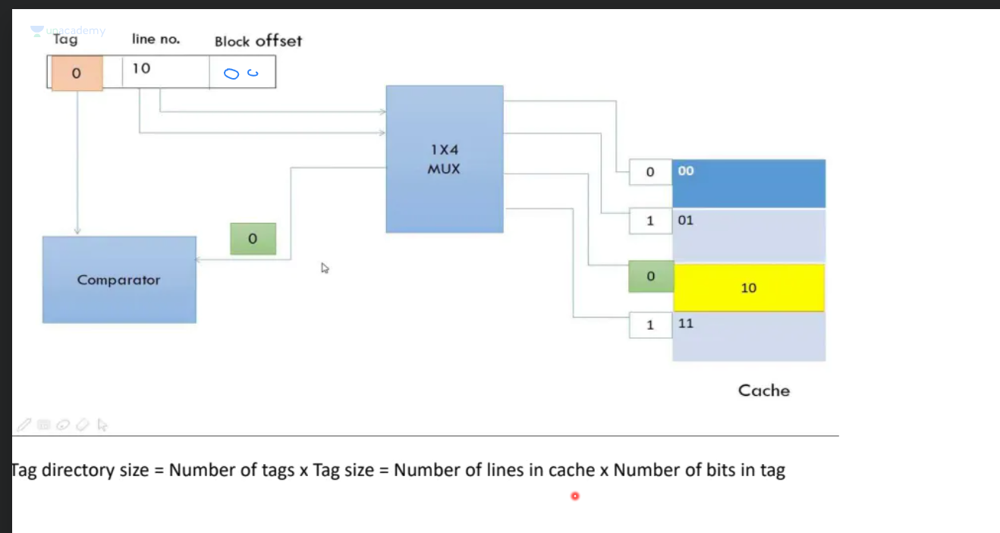

remember mux, it takes 2^n inputs has n control lines and generates 1 output.
in the above diagram, n control lines are n bits for cache lines, and input is attached to 2^n number of cache lines formed from those n bits.
now based on control lines only one output is generated which maps to the CL expected to hold the block, but before inspecting the block we pass it through comparator to match tag, if tag matches it means CL holds the block.

Remember in direct mapping each block can be in a specific cache line, either its in that cache line or its not in the cache.

# Important: In direct mapping each cache line needs to have a tag, and tag symbolises if the specific MM block exists in the CL,

# ASSOCIATIVE MAPPINTG

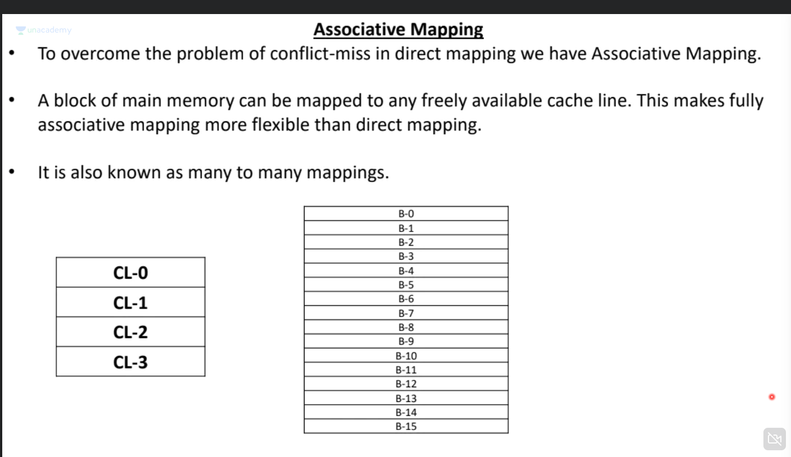

# SET ASSOCIATIVE MAPPING

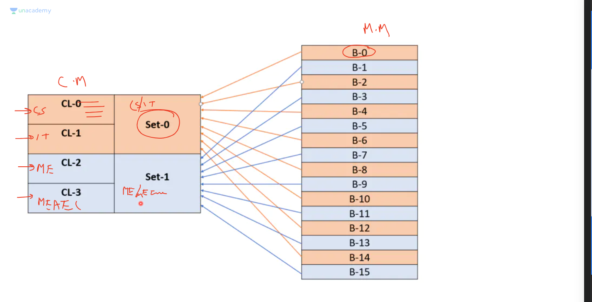

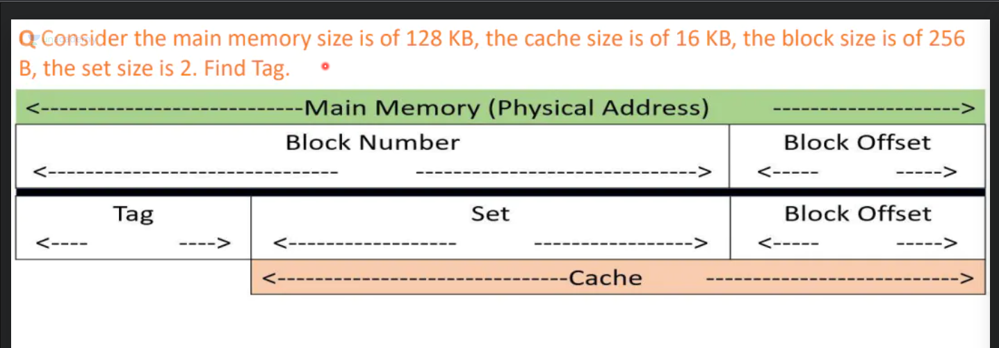

 # For Set associative remeber !!!
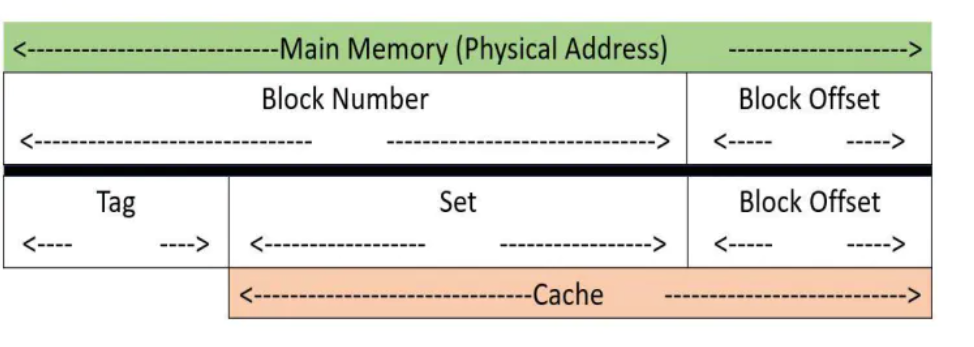

# Data replacement in cache

## Modified bit
suppose data comes in the cache and is 'A', suppos CPU modifies it to 'B'
Now cache has 'B' for mem address but MM and LM have 'A' for the same.
One way to resolve this is to not update immeditely, but add a modified bit extra to cache.
if this is set to 1, when data is evicted from cache, first its value is updated in MM.

## Valid bit
But sometimes cache contains garbage value, to do this we add a valid bit to the cache.
If this is set to 1, then it means the cache lines contain garbage value