# pipelining

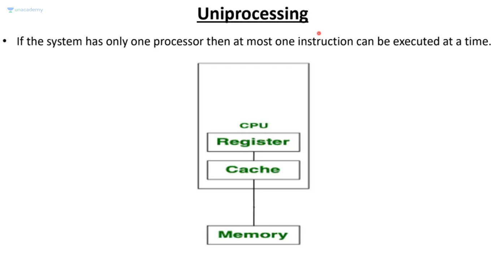

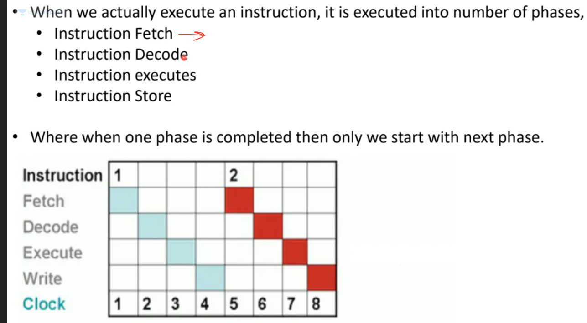

# instruction fetch:  get the instruction from memory

# instruction decode
## instruction opcode: the operation required by instruction
## instruction operand: the operands on which the operation (determined by opcode) needs to be performed

# instruction execute: perform the operation decoded above

# instruction store: store the details of operation in memory

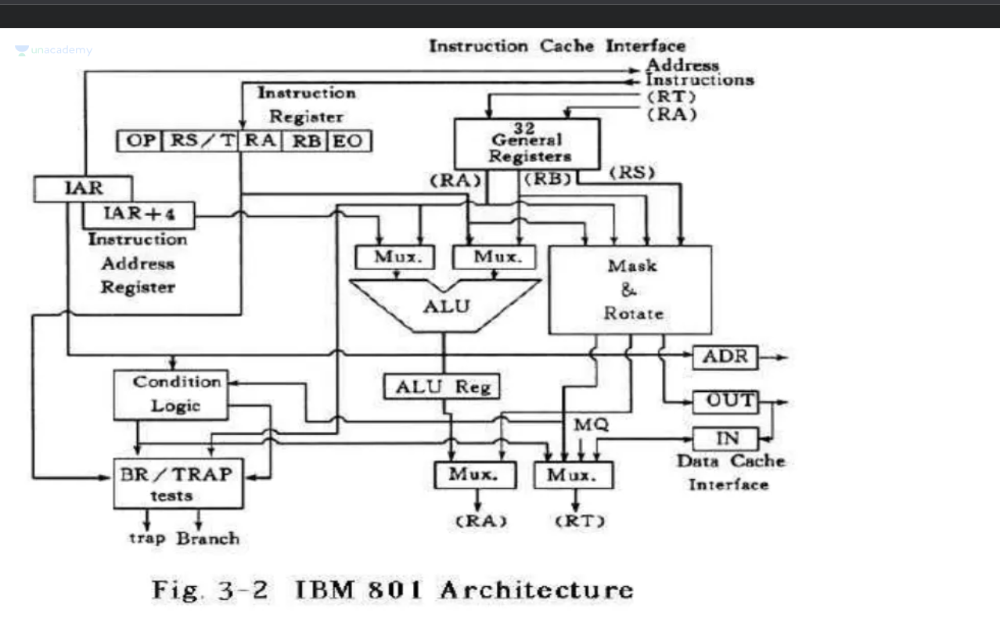

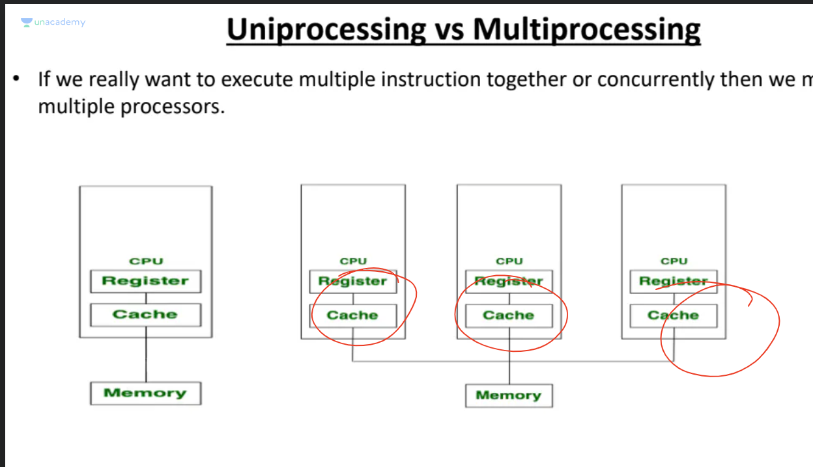

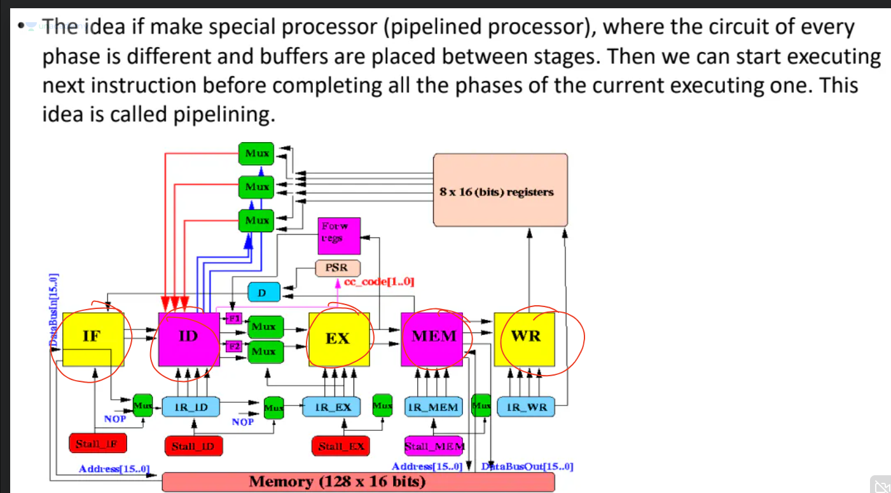

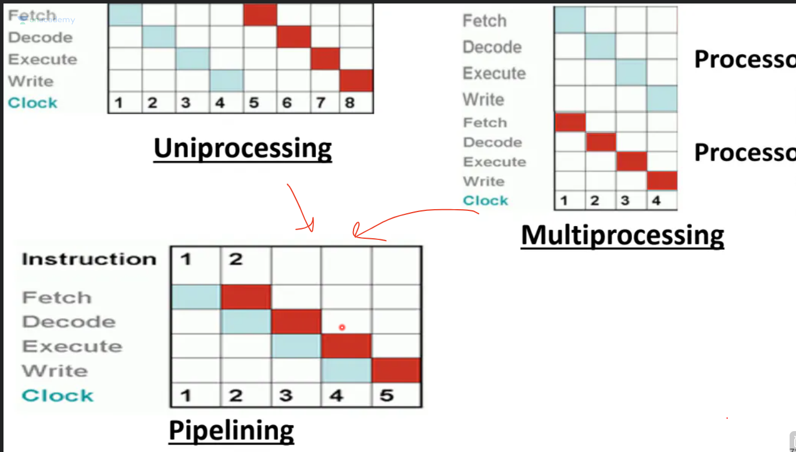

Usually in a normal cpu, details of current instruction are stored in CPU register and then cpu in its clock does one of the following:
(**NOTE:** each of the below takes 1 clock cycle)
- fetch
- decode
- execute
- store

in pipeline 
- there is seperate circuit for each of 4 phases in same processor, thus when decode is happening fetch can happen in parallel.

# Sample pipelining question:

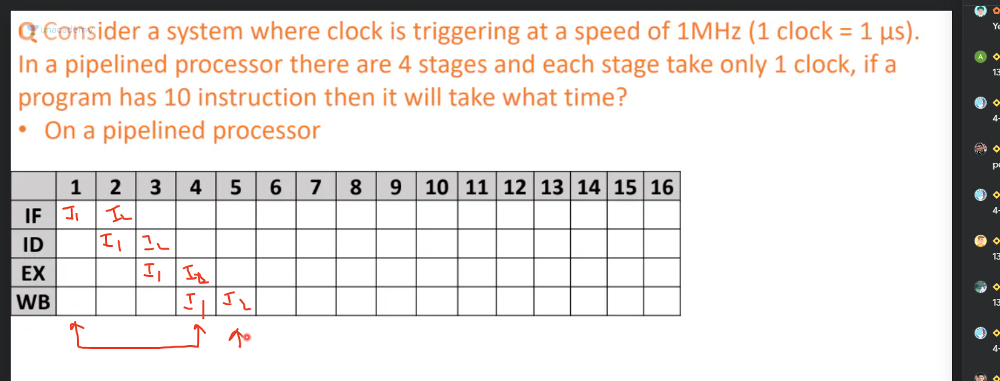

## solution

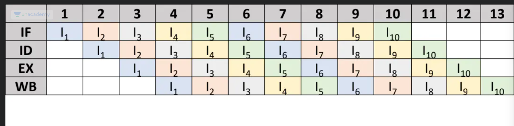

### formulae for pipelining

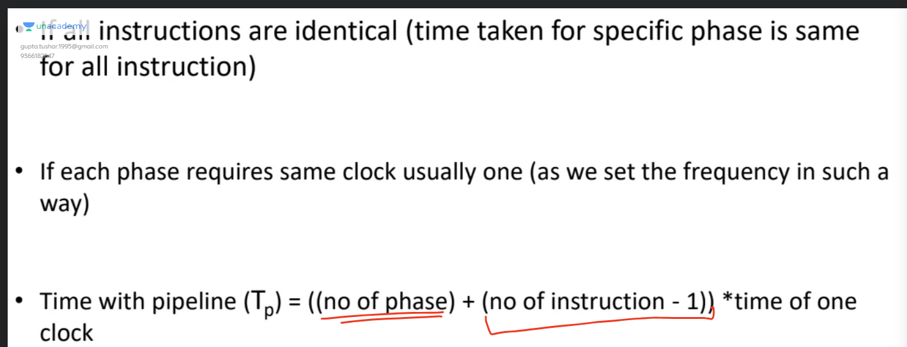

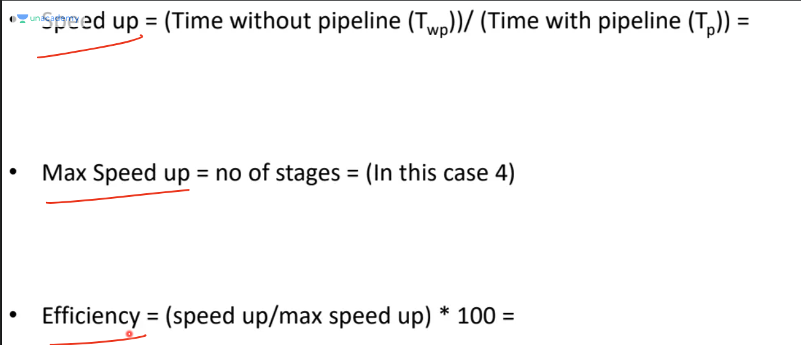

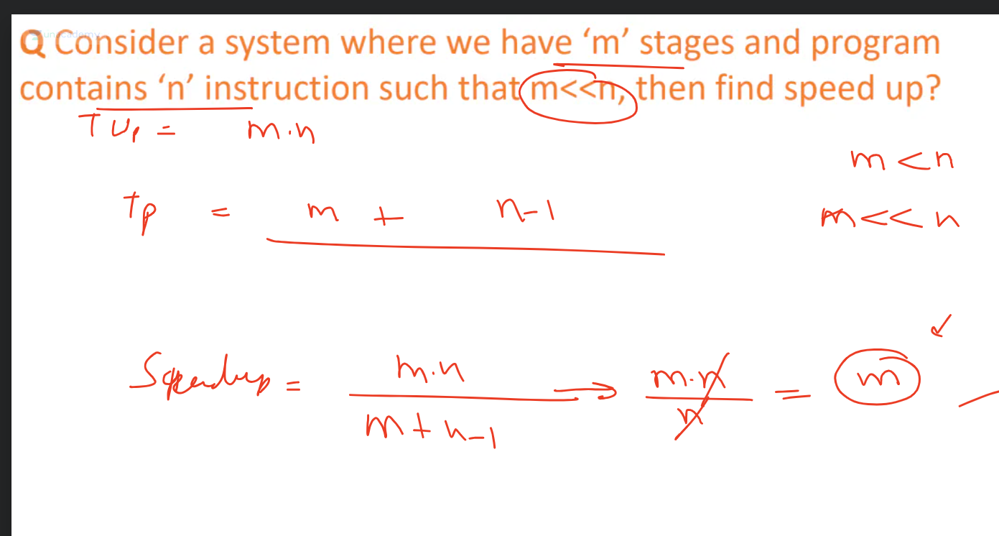

### CPI (clock per instruction) in pipelining
 - first instruction takes m clock cycles where m is number of stage per instruction (usually 4 as above)
 - from second onwards take 1 clock cycle
 - in long run CPI for pipelining should be 1 (with exception of first instruction)

# Understanding clock

If a cpu is 1 Ghz, then it completes 10^9 clock cycle in a second, so to complete 1 clock cycle, it will take, 10 ^-9 seconds = 1 ns.
if n processes take different times, to complete all process in same clock cycle, we just need to ensure that slowest process completes in 1 cs, and that will determine the min cpu frequency needed to complete a task.

- so might have to slow time taken to complete 1 clock cycle and thus cpu frequency if required to complete all processes in 1 clock cycle based on slowest process

**example:** 
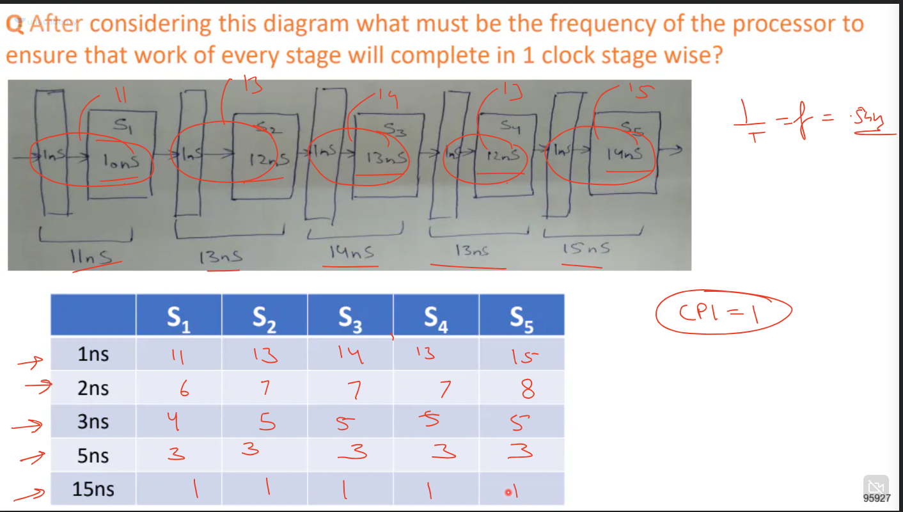

**Gate Question to show the slowest stage determines speed:**
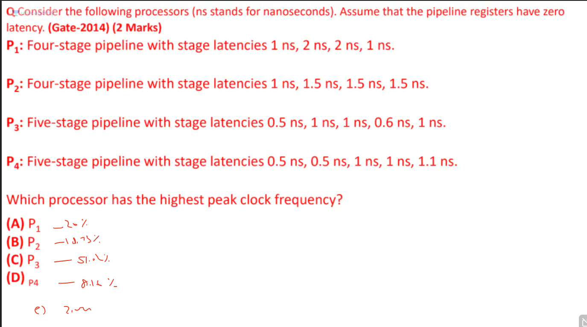