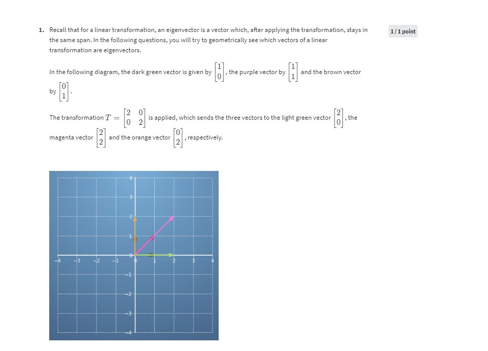

# Pre-Requisites
Refer [vector transformations](https://github.com/tushar-gupta-1995/general-notes/blob/main/Linear%20Algrbra/Vector-Transformations.md) for covering the pre-requisites.

# Definition
If on applying a vector transformation (multiplication of matrix), the vector direction changes it is not an eigenvector.

Refer:

