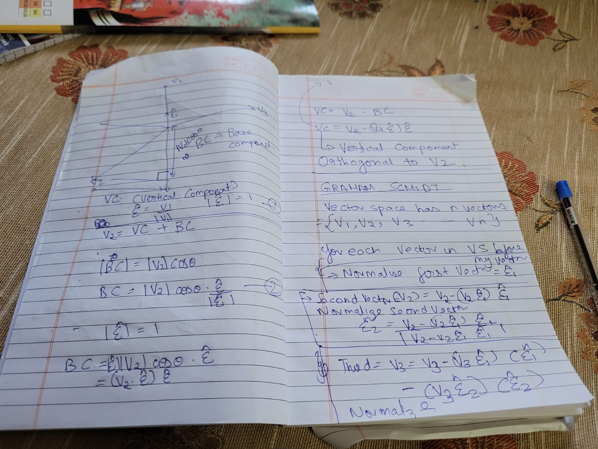

# Vectors
Vectors are just representing direction AND magnitude and NOT position. Therefore it is possible to shift position of vector without changing the meaning of vector. As long as direction and magnitude is preserved, its the same vector regardless of position.

# Linear independence
Two or more vectors are said to be linearly independent if none of them can be written as a linear combination of the others. On the contrary, if at least one of them can be written as a linear combination of the others, then they are said to be linearly dependent.**example:** consider a x-y plane where x is the horizontal axis and y is the vertical axis.
Now a vector say 2x+3y, is not linearly independent or linearly dependent on the x-y plane.
But a third axis orthogonal to x-y plane, lets say z axis cannot be represent in any linear equation of the x-y plane.
**summary:** therefore, a set of vectors {v1, v2, v3} is linear indipendent, if v3 cannot be written as cv1 + cv2.

# basis vectors and vector space
Basis Vectors are a set of linearly independent vectors, determine how an object moves in the vector space.
vector space is the space covered by the bounds of linear combination of the said basis vectors.

# Graham Schmidt Process
a set of basis vectors, is given lets call them {v1,v2,v3,...vn}.
We need to find a set of unit vectors lets call them {e1,e2,e3...en}, such that each unit vector is orthogonal to all other unit vectors and e1 is in direction of v1, while e2 has the component of v2 perpendicular to v1, e3 has component of v3 perpendicular to both v1 and v2.
**CORRECTION** in the paper notes `Orthoginal to V2` should be `Orthogonal to v1`
***Orthonormality:** a set of unit vectors orthogonal to each other.

Refer this for python code for computing graham-schmidt: [code](graham-schmidt.py)
