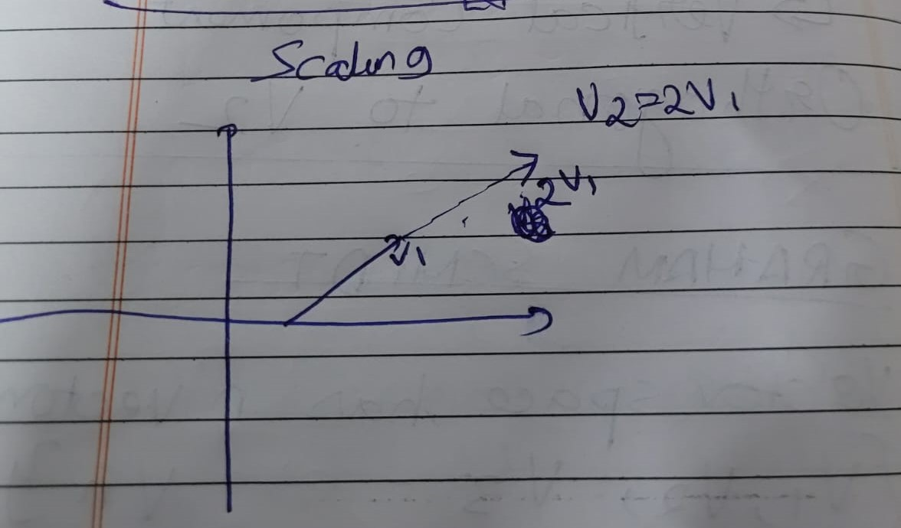
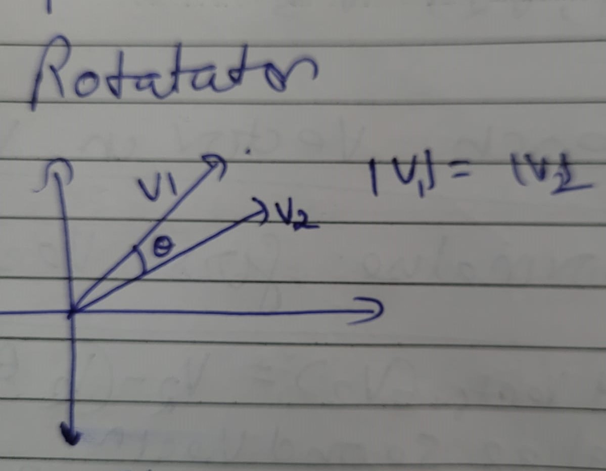
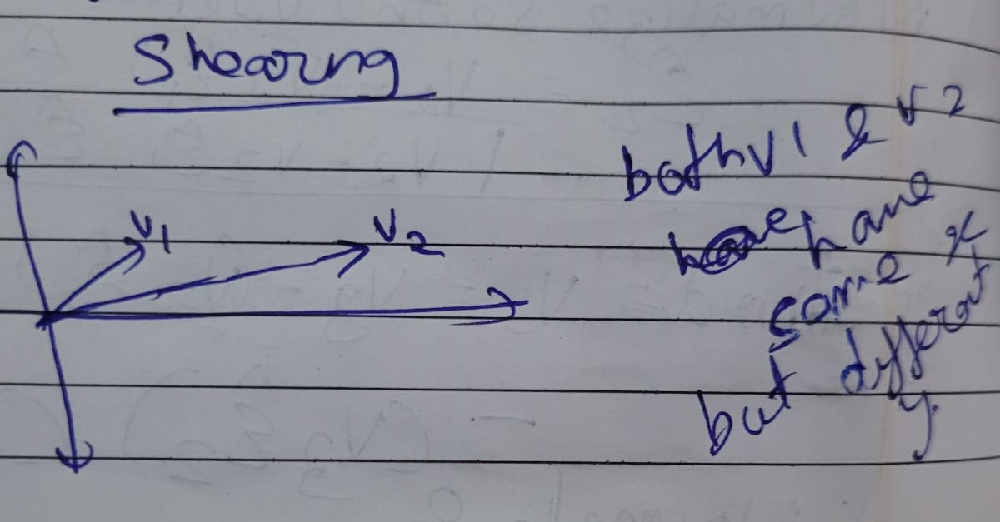
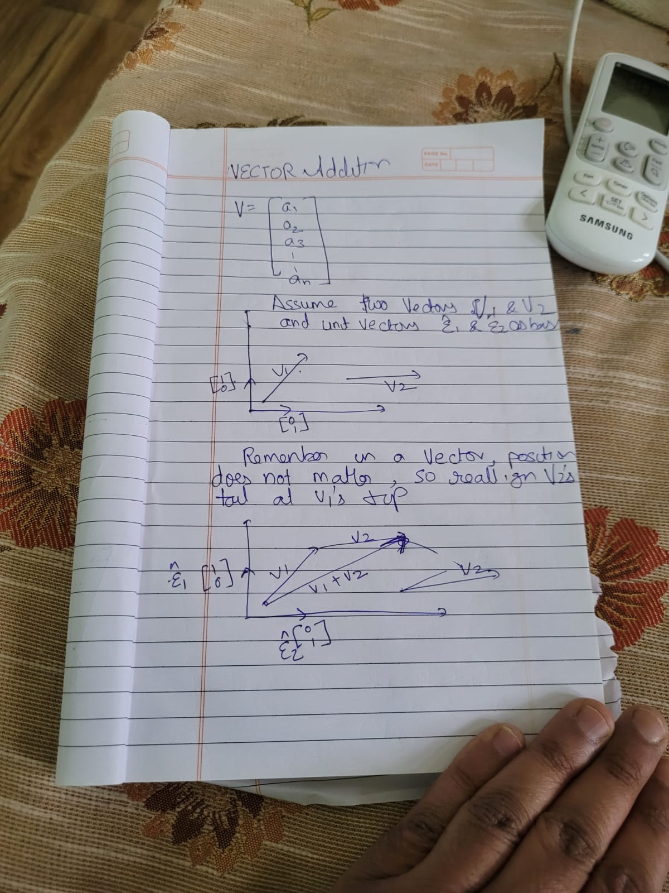

# Vectors
Vectors are just representing direction AND magnitude and NOT position. Therefore it is possible to shift position of vector without changing the meaning of vector. As long as direction and magnitude is preserved, its the same vector regardless of position.

# Linear independence
Two or more vectors are said to be linearly independent if none of them can be written as a linear combination of the others. On the contrary, if at least one of them can be written as a linear combination of the others, then they are said to be linearly dependent.**example:** consider a x-y plane where x is the horizontal axis and y is the vertical axis.
Now a vector say 2x+3y, is not linearly independent or linearly dependent on the x-y plane.
But a third axis orthogonal to x-y plane, lets say z axis cannot be represent in any linear equation of the x-y plane.
**summary:** therefore, a set of vectors {v1, v2, v3} is linear indipendent, if v3 cannot be written as cv1 + cv2.

# basis vectors and vector space
A set of linearly independent vectors, determine how an object moves in the vector space.
vector space is the space covered by the bounds of linear combination of the vectors.

# Vector Representation
a vector is represented by a column of values.each component of vector represents a movement in a unique direction.
the magnitude of direction in each component is the {value of each component * the unit vector in that direction}
The resultant direction is the summation of vector additions of each component.

# Types of vector transformation
## Vector scaling
Scaling a vector is multiplying a vector with a scalar quantity. scaling is like stretching the vector without changing anything else.
So if a vector points in the same direction, but its magnitude increases, it is being scaled.
HOWEVER scaling a vector in only one direction while keeping the other components constant will indeed change the direction of the vector.
Imagine i have a vector having some component in unit vectors i and j where i an j are linearly indipendent...scaling vector in only i 
will change direction and so will scaling in only j.
### Method:
Multiply the vector by scalar.

## Vector rotation
Rotating a vector is changing vector direction without changing its magnitude. So while scaling changes the magnitude but not direction,
rotation changes the direction but not magnitude.
### Method:
Convention is to multiply a vector with the below rotation matrix.
since cos^2θ + sin^2θ=1 the magnitude remains same but matrix changes direction.
| cos(θ) -sin(θ) |
| sin(θ) cos(θ) |

## Vector shearing
Shearing a vector is keeping one component constant but changing the other component's magnitude.
Example take a 2d vector, it can have a component in x-y plane. if we increase the magnitude of y, the vector's direction will change towards y, but it will have same component in x. The overall vector magnitude and direction may change but the component in x remains the same.This is shearing.
### Method
Shear across the x axis or horizontally
| 1 x |
| 0 1 |

Shear across the y axis or vertically
| 1 0 |
| y 1 |

# Vector Addition
Remember in a vector the position does not matter.
Assume walking 1 km in north and **THEN** 1 km in south from an **origin point** and reach a **destination point**
Draw a straight line from **origin** to **destination** and thats your summation vector or vector addition of 1km north and 1km south.
Notice the addition is commutative that is 1S + 1N = as !N + 1S.
Refer the image for more detail:

# Vector Multiplication
Vector multiplication is applying new basis vectors to a vector.
Imagine a simple 2d x y plane, in a single move you either move 1 unit in axis, or 1 unit in y axis, with a combination of these movements you traverse the x y plane. so if you move one unit in x and then 2 units in y, you move somewhat diagonally.
but now imagine tilting the axis lets call tilted x-y plane., now in a single move you can have component in both x and y axis, now in a single move you traverse diagonally in the original x-y plane..lets c
The question is if you move 1 unit in tilted x, and 2 unit in tilted y, then how much you move in the original untitled x-y plane.

Matrix multiplication provides answer to above, in AB A represents the basis vectors or they represent the axis, and B represents the vectors to which the transformation is being applied.

To simplify this lets play a game called `turtle` , just taking a reference from logo, the first game taught at school

## turtle game rules
The `turtle` is a 2 dimensional creature but it moves based on **predefined** rules.
The turtle can move in two linearly independent directions say `i` and `j`.
**to reiterate** `i` and `j` are linearly independent, so `i` can not be written in form `cj` where `c` is a constant.
### GIVEN: we will be given displacement in basis of identity vectors which are [1,0],[0,1]
### Challenge for all levels: we need to find the displacement in new basis vectors provided in each stage.
### stage 1
Stage 1, is simple `i` and `j` are just `x` and `y`. so `i` = [1,0] and `j` = [0,1].
A combination of `i` and `j` are the basis vectors for **stage 1** but they also are `identity matrix`
say turtle moves `a` in `i` and `b` in `j`, to solve the challenge we must solve:
| 1 0 ||a|
| y 1 ||b|
which is just [a,b].
### stage 2
Stage 2, is little complicated `i` and `j` are [i1,i2],[j1,j2], which is orthogonal but not identity.
A combination of `i` and `j` are the basis vectors for **stage 2**
say turtle moves `a` in `i` and `b` in `j` this can just be written as vector multiplication of:
| i1 j1||a|
| i2 j2||b|

### why this game: 
This game illustrates what matrix multiplication does. IT applies basis vectors on a given vector and tells us what will the vector be in the new basis vectors.
**THAT IS WHY MATRIX MULTIPLICATION IS NOT COMMUTATIVE THAT IS AB ≠ BA**
SINCE THE FIRST MATRIX IS THE BASIS AND SECOND IS THE VECTOR BEING TRANSFORMED, B BEING TRANSFORMED IN A'S BASIS IS DIFFERENT THEN A BEING TRANSFORMED IN B'S BASIS.

