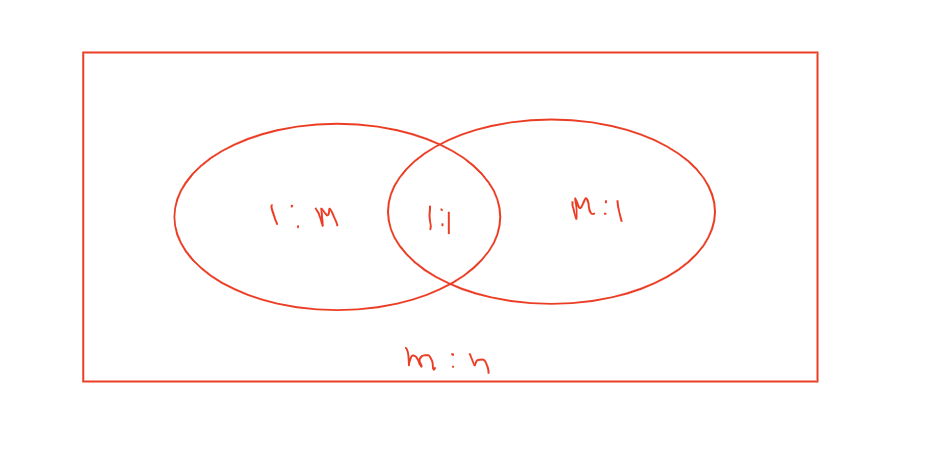

# Important Note WHEN creating set for cardinality
**the one with many in er diagram line, pick many from set, th one with a "1", pick one from set**

# tuple
row of the table

# domain/attribute
column in the table

# Database Schema
A database schema is a structure that represents the logical storage of the data in a database. It represents the organization of data and provides information about the relationships between the tables in a given database. In this topic, we will understand more about database schema and its types. Before understanding database schema, lets first understand what a Database is.

## example:

# types of attributes

## Multivalued: double ellipse: to tackle this create seperate table
## simple vs composite (composite broken into further parts, example name broken into first and last name), to tackle this create seperate column

# Relationships: represented by diamond

## Name:  Unique name of the relationship

## Degree: number of entities participating in relation, eg, unary binary, ternary, n-ary

## Structural constraints(cardinality, participation)

### Cardinalty

#### 1:1 relation
Either we do not participate, or participate exactly once.
1:1 shown by arrow pointing towards entity from relationship symbol.
or by writing 1 on the line from relation symbol to entity.

#### 1:n relation

#### m:n relation

# Strong and weak entity set

- weak entity set remains in total participation with the strong entity set
- weak entity represented by double rectangle
- weak relation represented by double diamond
- total participation represented by double line
- weak entity might be in relation with multiple strong entity set..however it has foreign key relation with only one, called its owneer entity set

# Number of tables for different cardinality of binary

- for a 1:1 relation, **no 3rd table to represent relation required**, just add a new column on the weak enrity key table for primary column of strong entiry, this becomes foreign key..(note since 1:1 the foreign key will not repeat more then once..it might not exist..but if it does it will be at max once.)
- for a 1:n relation, **no 3rd table to represent relation required**.

- Similarly for n:1: 

- So its reverse for 1:n types, the side in ER showing 1, participates n times and side showingn participate 1 time
- for a m:n relation, create a seperate table with primary key of both entity a and entity nb

- for ternary and >=2 ary just create seperate tables

