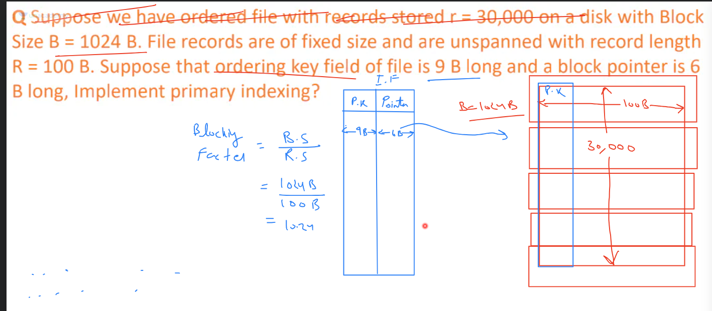

- Disk is divided in blocks -
- Database has records
- Primary index has primary key as key, and value is a pointer to the row ======> index table
- Total records per block is Integer part of number of blocks/number of records
- consider first record each block to get an entry in the index table
- we know that their is a fixed record length per block---> records/block
- once we reach the block via index table we can traverse the records/block to reach the desired record.
- So total number of blocks for holding records is upper bound of total records/block size ----> reserved blocks
- total size of a single index is primary key size + pointer size
- total blocks required for index = reserved blocks/index size