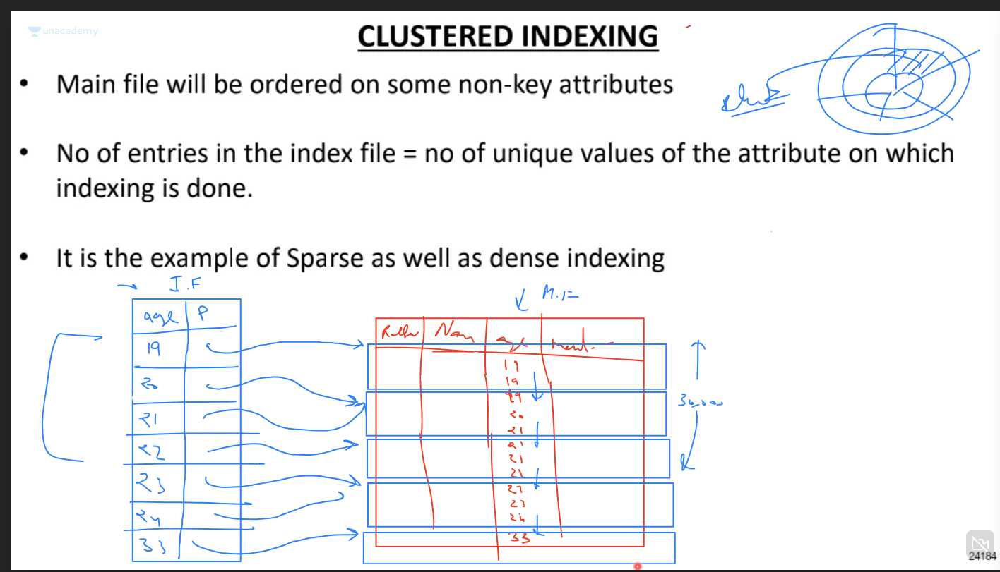
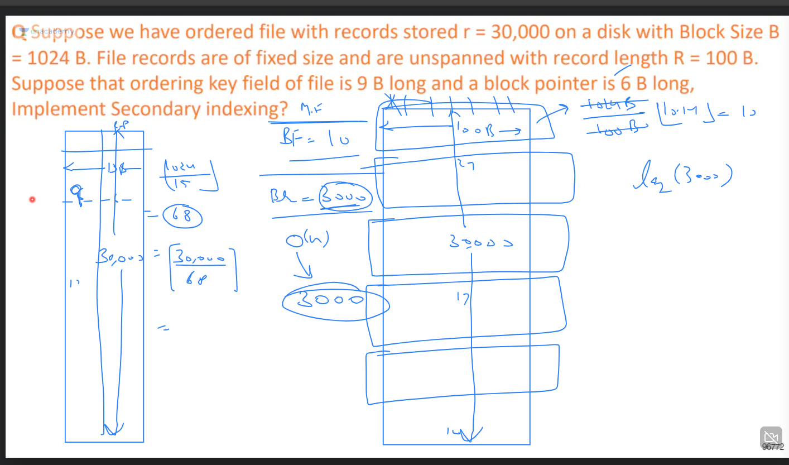
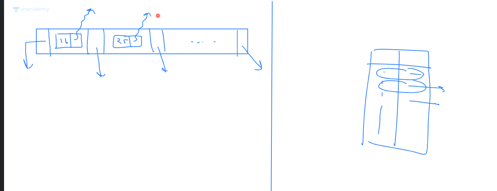
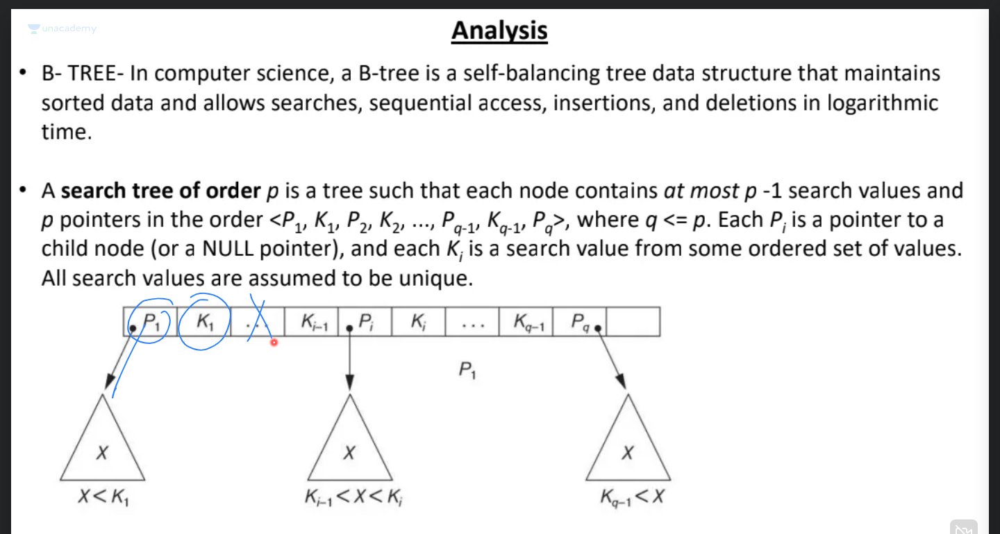
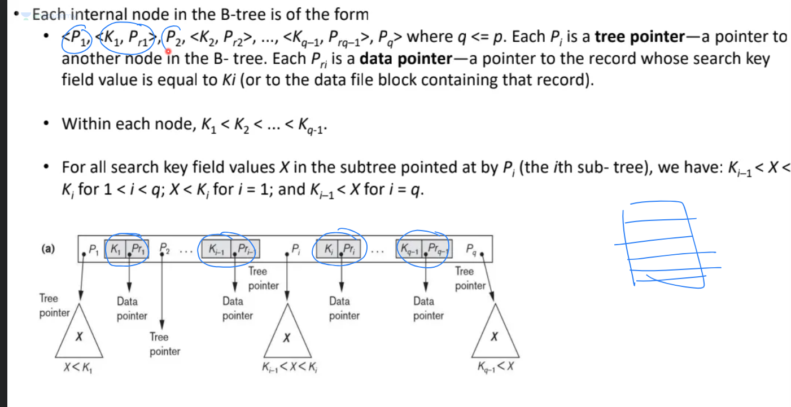
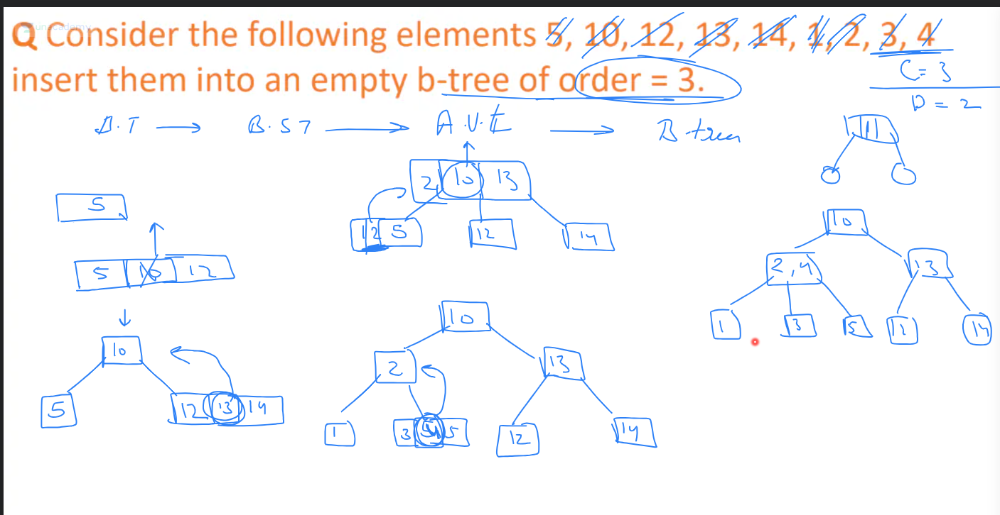
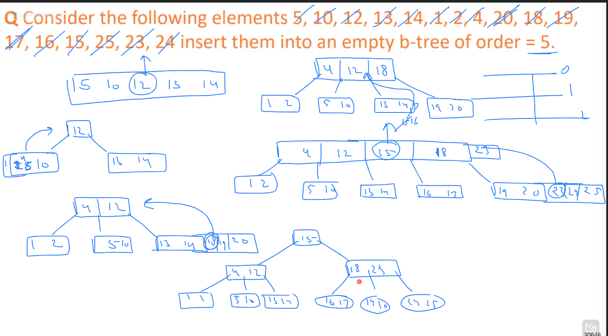

# Prime indexing: Non clustering index (On primary key) (Sparse indexing)
- Disk is divided in blocks -
- Database has records
- Primary index has primary key as key, and value is a pointer to the row ======> index table
- Total records per block is Integer part of number of blocks/number of records
- consider first record each block to get an entry in the index table
- we know that their is a fixed record length per block---> records/block
- once we reach the block via index table we can traverse the records/block to reach the desired record.
- So total number of blocks for holding records is upper bound of total records/block size 
- total size of a single index is primary key size + pointer size
- total blocks required for index = block size/index size
- Not all entries need to be there in index, since records are sequential, only header of each block is there.
- only one entry in index per block NOT record,

# Clustered Index
- indexing on non key attribute
- each first instance unique value in non key gets a unique pointer to a block
- then other instances of that value can be tracked sequentially

# Secondory Index (Dense index): Non primary key non sorted

- same steps as primary index, but sorting is not done
- all record entries need to be there in index, since data is not sorted, if i land at a block, it is not guaranteed that there are only seuqnetially increasing/decreasing blocks after it.
- but the index id itself is sorted, index id's are just id which have the record number and pointer to the record row.
- we can binary search on index entries post this.

# B-tree
- Order is number of children
- A B-tree of order m is a search tree in which each nonleaf node has up to m children
- parent node can have m-1 data index
- if there are n elements in the btree, and m elements per level, then the complexity to reach a level is (log base m)n
- each data index in btree is actually a row in db index table, that is it contains the key column, and the pointer to the actual row in database.
- also each index in node is followed and preceeded by a pointer to the left and right child of the index.
- Refer the below diagrams

- 

