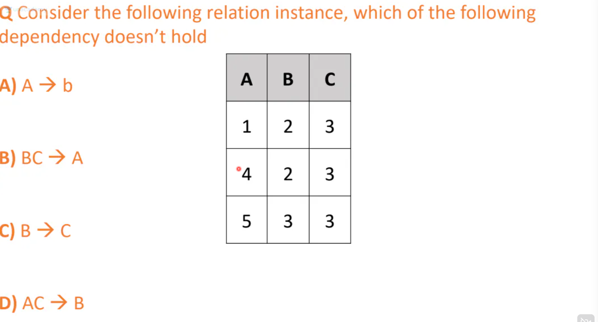
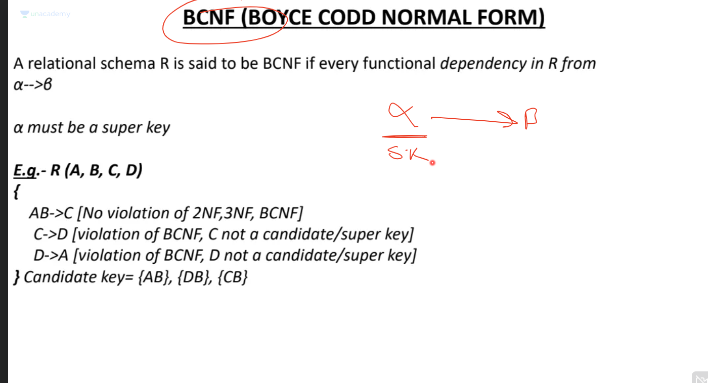
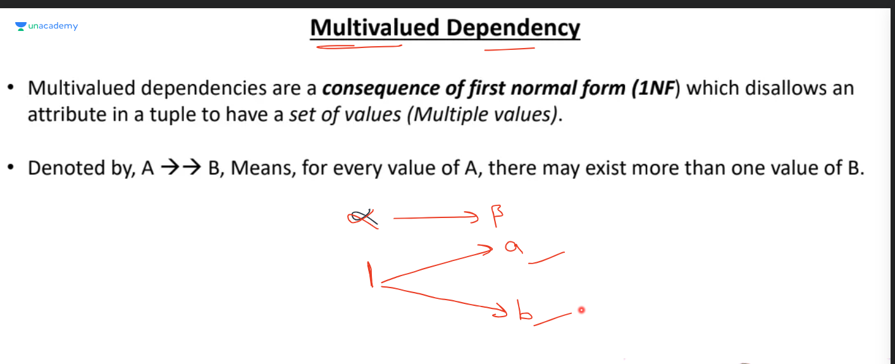
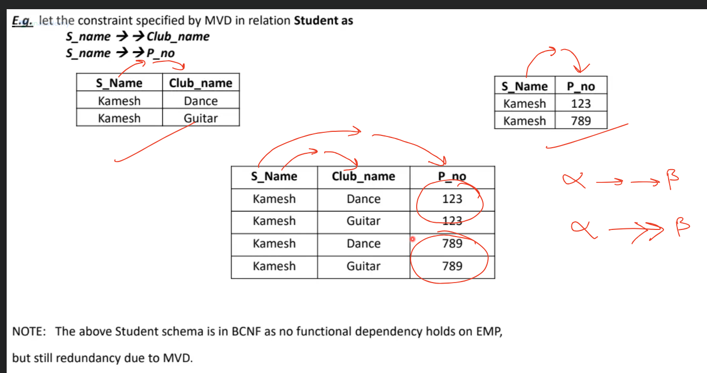
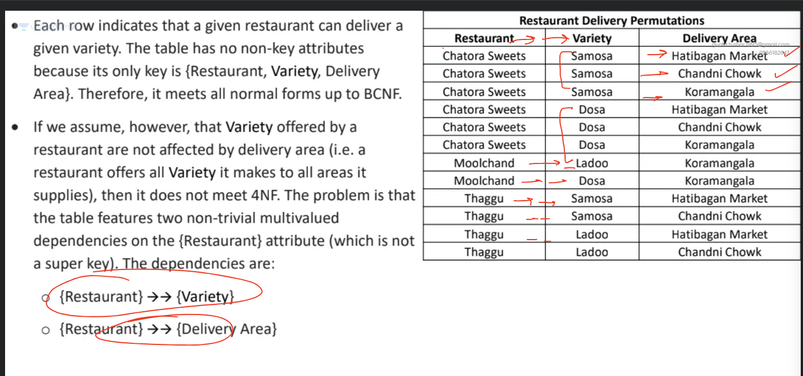
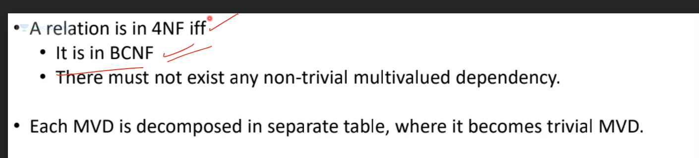
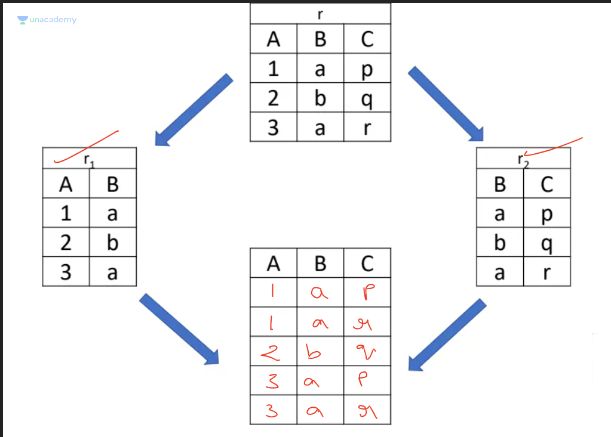
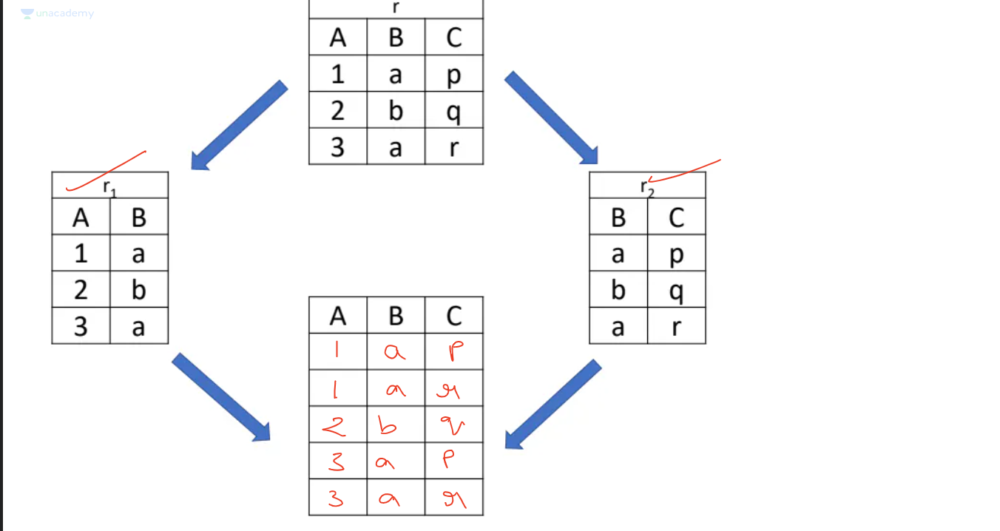
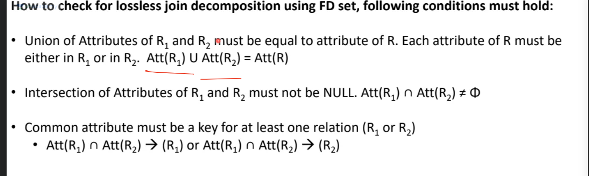

# Insertion Anamoly :

- in the above table branch_code, branch_name and brach_age are seperate pieces of info
- assume in above table roll no of student is primary key
- if a new branch is opened, currently with no student, it cannot be inserted into this table
- thus in this table branch gets dependent on student even though in real life its not
- further if we want to remove a student, then branch details also need to be removed, but branch is technically not dependent on student, however due to table design this dependence exists in db. **This is deletion anamoly**
-further if we want to update a hod name for one branch, i will have to do it for each row where that hod exists, if one row is missed, it leads to loss of integrity **This is deletion anamoly**

**Solution:**

# functional dependency
if a->b, where b can derived from a, then b is functionally dependent on a.

To prove a=>b
if two or more values in a are same and output different b.
in that case b is indipendent of a.

# Trivial Functional Dependency:
if b is subset of a such that a=(p,q,r)
and b = (q)
then a->b will always hold..since its **obvious**

**Example** in option C, RHS is subset of LHS hence trivial.

# Functional Dependency Closure

## Mininmal cover

# Armstrong axioms

# types of keys

# KEY: Any key is a set of attributes(remember attributes=columns)
# Super Key: Set of attributes whose closure covers all attributes (remember attributes=columns)

 

# candidate key: minimal set of attributes required to represent a row..that is a candidate key cannot be further broken

# primary key

# Foreign key can ALSO be in the same table as primary key, that is it can refer to the primary key in same table, Example:
- CR is a person amongst the roll numbers
- if i dlete roll number 1 and roll number 1 is the CR, it does not make sense, hence both PK and FK in same table
- Remember FK exists because of the primary key reference...if primary key reference CAN only be removed if FK constraints are removed.

# Remember one table can have more then 1 foreign key example, in a m:n relation we form a 3rd table with PK of both entities..so it has 2 foreign keys

# foreign key reference a primary key..foreign key is a subset of primary key they reference//

**Given fk -> pk**
- pk is superset of fk
- pk can be added without constraint
- fk can be removed without constraint
- pk cannot be removed without deleting all fk referencs first
- fk cannot be added without adding a pk which it refers to

# secondary key 

# Normalisation

## First normal form

## Second normal form

### Transitive dependency

if a non prime attribute is functionally dependent on another non prime attribute

## Third normal form

In summary

- **2nf**: partial dependency, part of prime attribute identifies non prime..when prime is composite
- **3nf**: transitive dependency, non prime attribute identifies another non prime attribute
- **bcnf**: LHS in fd, must always be a super key, that is if a->b, then a MUST be a superkey, ****therefore, if there are only 2 attributes they are always in bcnf**

**Remember** prime attribute is that attribute that is part of candidate key.

## BCNF

**There can be redundancy in bcnf but it cannot be redundancy due to Functional dependency**

# Multi valued Dependency

a->b
b can be identified from a

a->->b
multiple values of b can be identified from a

**Example: student -> phone number is a multi valued dependency, one student can have multiple numbers**

In the below image, table is in bcnf as all rows are unique, all columns combined form the candidate key, and they together identify all attributes.
Even though BCNF is satisfied and therefore 1,2,3nf are satisfied as well, multivalued dependency is causing redundancy.

## 4nf

## Dependency preserving decomposition

So if a table R is decomposed into R1 and R2 and on joining i get R3, if R3=R then its lossless
if R3 is subset or superset of R then its a lossy decomposition.

**ALSO if decomposed table has no column in common that decomposition is always lossy**

**AlSO IF A COLUMN IS MISSING FROM INITIAL TABLE IN DECOMPOSED TABLE, THAT IS IF R HAS COLUMN NEITHER IN R2 AND R3, ITS LOSSY**

**RULE TO ENSURE LOSSLESS**
- AT LEAST ONE COMMON COLUMN IN BOTH TABLES
- ALL COLUMNS FROM ORIGINAL DECOMPOSED TABLE INCLUDED IN NORMALISED TABLES
- THE COMMON COLUMN SHOULD ACT AS A KEY IN AT LEAST ONE OF THE NORMALISED TABLES

