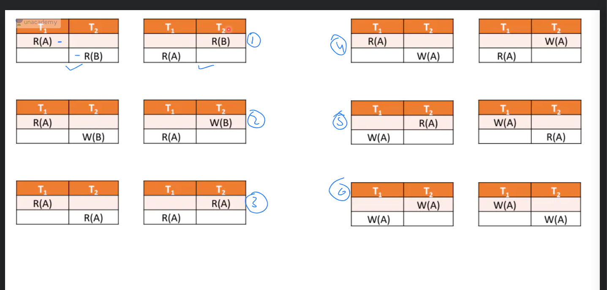

# ACID
- Atomic : If a transaction which might contain multiple sql queries with update and insert is not completed it can be rolled back.
- Consistent: Same attribute cannot have different values
- Isolation: Each transaction runs in isolation and completes such that they are concurrent
- Durability: Data is written to file and should persist in case of system failures etc.
- Not redundant: Copies of data should not exist

## ACID EXAMPLES:

- Atomicity: As we can see in the below image, the transaction begins with few inserts, if any insert fails it rollbacks all the previous inserts.

### Isolation:
Transaction isolation levels are used in database management systems (DBMS) to control the level of interaction between concurrent transactions. 

The four standard isolation levels are:
- Read Uncommitted: This is the lowest level of isolation where a transaction can see uncommitted changes made by other transactions.   This can result in dirty reads, non-repeatable reads, and phantom reads.

- Read Committed: In this isolation level, a transaction can only see changes made by other committed transactions. This eliminates dirty reads but can still result in non-repeatable reads and phantom reads.

- Repeatable Read: This isolation level guarantees that a transaction will see the same data throughout its duration, even if other transactions commit changes to the data. However, phantom reads are still possible.

- Serializable: This is the highest isolation level where a transaction is executed as if it were the only transaction in the system. All transactions must be executed sequentially, which ensures that there are no dirty reads, non-repeatable reads, or phantom reads.

#### Concurrency

##### Lost update/ write-write problem
- consider transaction 1 is partially commited and is writing some value, and transaction 2 starts after transaction 1 and transaction 2 commits before transaction 1 is commited, and then transaction 1 is commited after, in this case transaction 2 overwrites transaction 
` Remember due to isolation property each transaction is unaware of all others.`
- `blind write`: if the second transaction just writes without reading.

Refer the below image:

##### Dirty Read/ read-write problem

Read an uncommited transaction, which might get rolled back.

Question on dirty read: 

##### Unrepeatable read problem

##### Phantom read problem

##### Solution to all above: schedule

##### Types of schedule 

Legend for the above image:
- S = Serialisable
- C = Consistent
- NS = Non serialisable
- CS = conflict serialisable
- VS = View serialisable

###### Serial Schedule

Putting all transactions in a queue and execute them one by one.
The next transaction only begins when previous completes.

**Note** the order of transaction in which they are inserted to queue does not matter.

Assume 3 transactions are there, T1, T2 and T3,
Now for first one to run we have 3 choices, T1/T2/T3
for second we have 2 and last we have 1.

This means there are 3! ways to achieve this.

so for n transactions there are n! schedules.

###### Non Serial Schedule

**Remember if there are n things to be arranged  such that k out of them always appear in the same order then the answer is n!/k!**

Now in non serial, we cannot change the individual order of instructions in a transaction but we can interweave them with instructions of other transaction, As long as no order of instruction in any transaction is violated.

Now suppose i have two transactions t1 and t2 with 2 and 4 instructions respectively and i want to find the number of non serial schedules then the answer is:
total 6 transactions out of them 2 of t1 are in one order and 4 of t2 in another, but they are interwovem
so 6!/2!.4!-2
The 2 is subtracted as in cases where t1 occurs first completely before t2 or t2 completely occurs before t1 are serial.

**Remember by default non serial might not guarantee consistency, since of T1 reads after T2 writes it might lead to the dirty read problem..or it might lead to all above concurrency issues.**

**PROBLEM:** Serial is slow and consistent, Non serial is fast but inconsistent

**SOLUTION** if we can prove given non serial transaction have the property of serial transaction, then process the transaction non serially.

###### Solution for Non Serial Schedule

Numbered scenario in below image:

**Based on above image lets discuss scenarios**
- Scenario 1: why concurrency wont be an issue: READ and Different Data set, so no conflict
- Scenario 2: Different dataset, so no conflict
- Scenario 3: Same Dataset But Read, so no conflict
- Scenario 4,5,6: Same dataset, at least one transaction write, so conflict

**Conclusion for conflict**
Two transactions are said to be conflicting if:
- instructions are different
- operate on same value
- at least one of them is a write 

We can run non conflicting transactions concurrently but not conflicting.

###### Conflict equivalent schedule

**Question:**

###### Conflict Serialisable schedule
- Design instructions of transactions in a precedence graph
- If a cycle exists in the graph it is NOT conflict serialisable
- In other words if instructions of transactions can be topologically sorted, then it is Conflict Serialisable

###### View Serialisable schedule

###### Non recoverable schedule

###### recoverable schedule

###### cascading rollback schedule

###### cascadeless rollback schedule

###### Deciding if schedule is cascadeless/cascading and recoverable/cascading and not recoverable

###### Strict schedule

No read and write allowed on an uncommited written dataset.

###### Blind Write:
 Performing the Writing operation (updation), without reading operation, a such write operation is known as a blind write. If no blind write exists, then the schedule must be a non-View-Serializable schedule.

### Consistency: 
If isolation, durability, atomicity holds true then consistency automatically holds true.
But consistency refers to data as a whole being consistent.
so if debit happens from account a and credited to account b, the sum of account a and b should be same before and after:

Example of consistency is below gate question:

NOTE: here atomicity and consistency may seeem intertwined, but remember atomicity is either execute fully or not, while consistency is focussed on integrity, even though atomicity is critical for ensuring integrity, they are different properties.

### Transaction
a bunch of instructions bound in a bundle such that they behave as a single instruction.

# IMPORTANT: ALL TRANSACTION FOLLOWS THE ACID PROPERTY ABOVE

Any set of instructions(program) which can include read and write operations, that either execute fully or don't such that any failed instruction rollbacks all instructions executed from the set, is called a transaction
In simple words if a program instructions and guarantees to execute fully not not at all, its called a transaction.

#### Operations in transaction

In essence transaction are a bunch of instructions combined together or bound together to behave like a single instruction.

#### Transaction States
- Till the time transaction state is executing its active.
- When the instruction is executed but not committed its called `partially commited.` In other words instructions have executed but commit command has not executed or is executing but has not completed.
- till here if any failure happens all changes are rolled back.
- when the results of instructions are completely commited its called `commited`

# Schema vs Instance:
- Schema: strucure of data
- Instance: snapshot of data at any given time.

# Concurrency control

## Timestamp based method

### Read Timestamp:
Whenever a transaction reads a data item, it assigns the entry point of the transaction to the data item
so on a data item q, read timestamp is 16:52, then the transaction which last read q entered system at 16:52

- If  the entry time of transaction say T1, is less then timestamp assigned to dataset say Q, and it wants to read Q, then T1 is attempting to read a transaction that is overriden after it entered and thus does not offer isolation (a transaction should seemingly execute such that it is the only transaction)

- If  the entry time of transaction say T1, is more then timestamp assigned to dataset say Q, and it wants to read Q, its allowed.

### Write Timestamp:
Whenever a transaction writes a data item, it assigns the entry point of the transaction to the data item
so on a data item q, write timestamp is 16:52, then the transaction which last wrote q entered system at 16:52

## Lock based method

While operating on the data item, lock it.

## Validation based method

### Lock based

- System model
- Add a lock on data before doing any operation
- perform the operation
- release the lock 
- But read-read dont clash, read-write do, so if two transactions reading the same data, they can do in parallel sharing the lock, so a write operation does not modify the data.
- Is **Not Conflict Serialisable**
**To avoid above point introduce two phase locking**

**Important: STARVATION:** Long wait is NOT starvation, a fifo cannot **starve** regardless of the wait in fifo.
but lifo can be starvation, because the first element enetered might have to wait if newer elements keep entering the stack.
that is if processor is biased towards the latest processes or some priority thus not giving cpu cycle to older processes then its starvation.
for fifo its not starvation, but **convoy effect**

